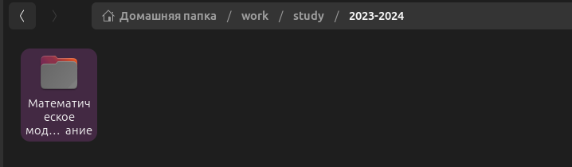
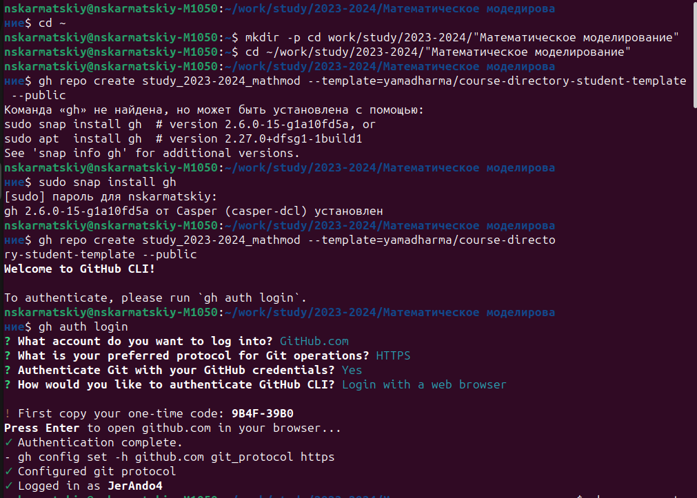
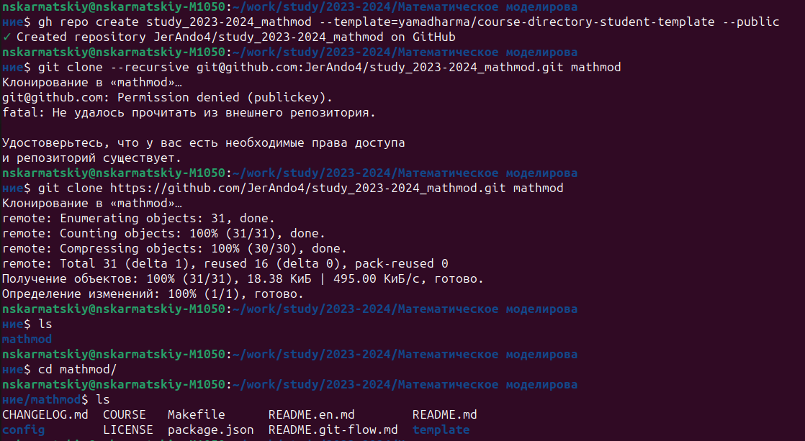
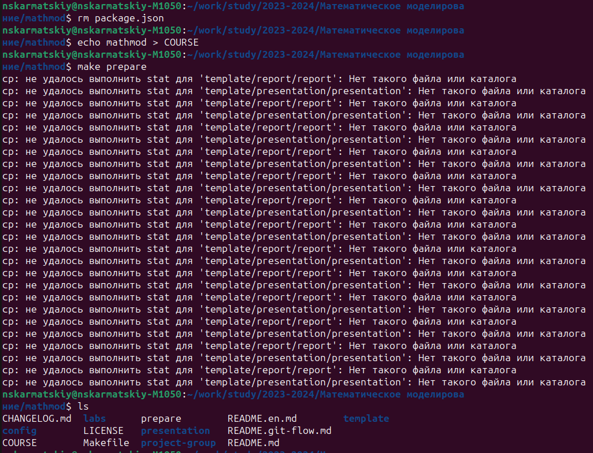
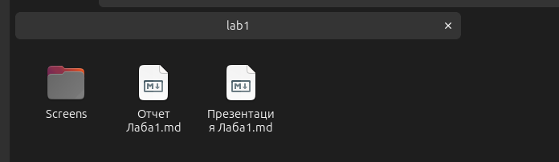
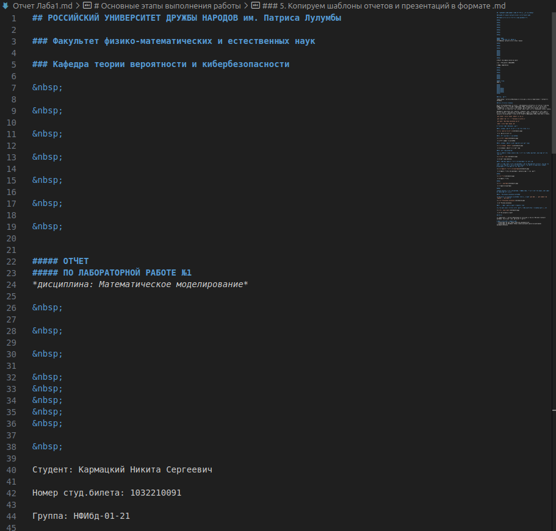
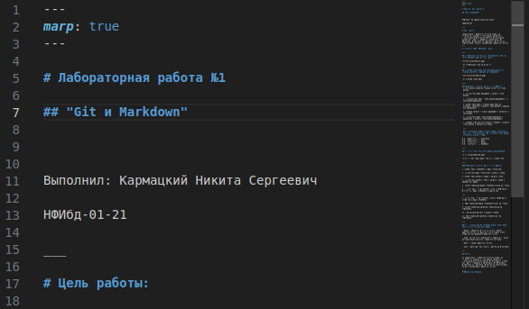
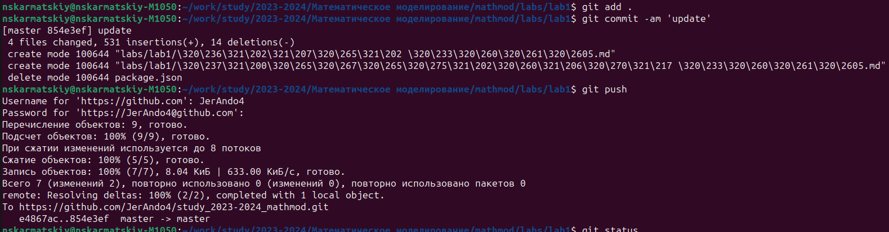
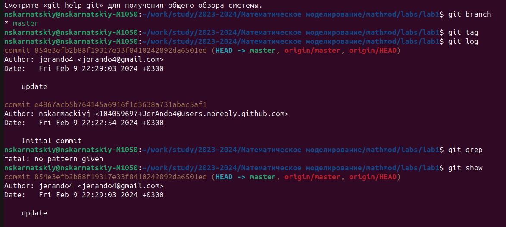

## РОССИЙСКИЙ УНИВЕРСИТЕТ ДРУЖБЫ НАРОДОВ им. Патриса Лулумбы 

### Факультет физико-математических и естественных наук

### Кафедра теории вероятности и кибербезопасности

&nbsp;

&nbsp;

&nbsp;

&nbsp;

&nbsp;

&nbsp;

&nbsp;

##### ОТЧЕТ
##### ПО ЛАБОРАТОРНОЙ РАБОТЕ №1
*дисциплина: Математическое моделирование*

&nbsp;

&nbsp;

&nbsp;

&nbsp;
&nbsp;
&nbsp;
&nbsp;
&nbsp;

&nbsp;

Студент: Кармацкий Никита Сергеевич

Номер студ.билета: 1032210091

Группа: НФИбд-01-21

&nbsp;

&nbsp;

&nbsp;
&nbsp;
&nbsp;

##### Москва
2024 г.

&nbsp;
&nbsp;
&nbsp;
&nbsp;
&nbsp;
&nbsp;
&nbsp;
&nbsp;

&nbsp;
&nbsp;
&nbsp;

### Цель работы:

Ознакомление с cистемой управлений версиями git, а так же ознакомление с синтаксисом markdown.

### Теоретическое введение

Git — система управления версиями с распределенной архитектурой. В отличие от некогда популярных систем вроде CVS и Subversion (SVN), где полная история версий проекта доступна лишь в одном месте, в Git каждая рабочая копия кода сама по себе является репозиторием. Это позволяет всем разработчикам хранить историю изменений в полном объеме.

Markdown — облегчённый язык разметки, созданный с целью обозначения форматирования в простом тексте, с максимальным сохранением его читаемости человеком, и пригодный для машинного преобразования в языки для продвинутых публикаций (HTML, Rich Text и других). 

`git clone - клонирование репозитория на ПК`

`git commit -am '///' - Оставление комментария`

`git push - Загрузка изменений на гит`

`make - конвертация файла .md`

# Основные этапы выполнения работы

### 1. Создаем рабочую директорию на своем компьютере:  

Рис.1 Рабочая директория

### 2. Авторизируемся через GitHub:  

Рис.2 Авторизация через GitHub

### 3. Создаем репозиторий по шаблону и его настройка:  

Рис.3 Создание репозитория и настройка

### 4. Настройка каталога:  

**В этом пункте создаем каталог lab, в который мы будем загружать наши лабораторные работы**

Рис.4 Настройка каталога

### 5. Копируем шаблоны отчетов и презентаций в формате .md

**Тут мы скопировали отчеты и презентации с курса "Операционные системы", так как они имеют свой стандрат. А так же их легко изменять в процессе скринкаста по созданию презентации и отчета лабораторной работы.** 

Рис.5 Шаблон отчета и презентации в каталоге лаборторной работы

&nbsp;

Рис.6 Шаблон отчета

&nbsp;

Рис.7 Шаблон презентация

&nbsp;

**Далее изменяем отчет и презентацию в папке lab1, что бы в них содержалась информация по нашей лабораторной.**

### 6. Отправление изменений на GitHub  

**Отправляем все изменения на GitHub с помощью команд `git add .`, `git commit -am 'Update'`, `git push`**

Рис.8 Отправка изменений

### 7. Пробуем разные команды связанные с Git  

**После завершения основной части работы, эксперементируем с командами git [...]**

Рис.9 Опробованные команды

## Вывод: 

Мы ознакомились с cистемой управлений версиями git, а так же вспомнили синтаксис markdown. так же настроили рабочее пространство

# Список литературы. Библиография
- Документация по Git: https://git-scm.com/book/ru/v2
- Документация по Markdown: https://learn.microsoft.com/ru-ru/contribute/markdown-reference