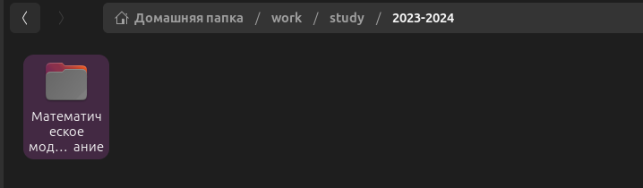
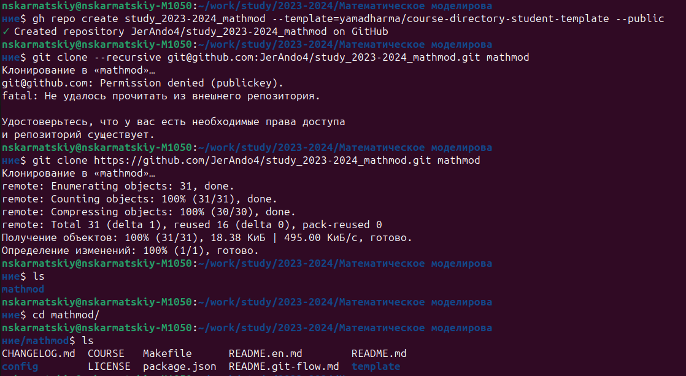
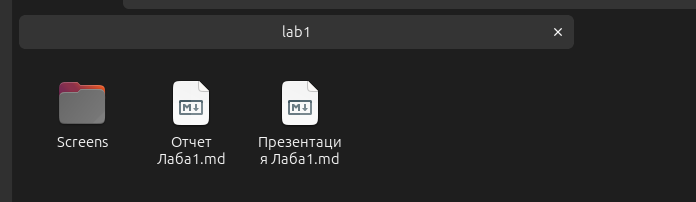
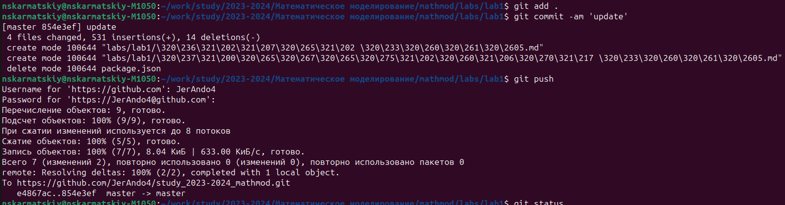

# Лабораторная работа №1

## "Git и Markdown"

Выполнил: Кармацкий Никита Сергеевич

НФИбд-01-21

___

# Цель работы:

Ознакомление с cистемой управлений версиями git, а так же ознакомление с синтаксисом markdown.
___

# Основные этапы выполнения работы

___

## 1. Создаем рабочую директорию на своем компьютере:  

Рис.1 Рабочая директория
___

## 2. Авторизируемся через GitHub:  

Для этого использовали команду git auth login, в итоге выполнения этой команды мы смогли через командную строку управлять нашими репозиториями

____

## 3. Создаем репозиторий по шаблону и его настройка: 

Рис.3 Клонирование шаблона репозитория
___

## 4. Настройка каталога:  

**В этом пункте создаем каталог lab, в который мы будем загружать наши лабораторные работы**

___

## 5. Копируем шаблоны отчетов и презентаций в формате .md

**Тут мы скопировали отчеты и презентации с курса "Операционные системы", так как они имеют свой стандрат. А так же их легко изменять в процессе скринкаста по созданию презентации и отчета лабораторной работы.** 

Рис.5 Шаблон отчета и презентации в каталоге лаборторной работы

___

### 6. Отправление изменений на GitHub  

**Отправляем все изменения на GitHub с помощью команд `git add .`, `git commit -am 'Update'`, `git push`**

Рис.8 Отправка изменений

___

### 7. Пробуем разные команды связанные с Git  

**После завершения основной части работы, эксперементируем с командами git [...]**

Рис.9 Опробованные команды

___

## Вывод: 

Мы ознакомились с cистемой управлений версиями git, а так же вспомнили синтаксис markdown. так же настроили рабочее пространство

___
# Спасибо за внимание