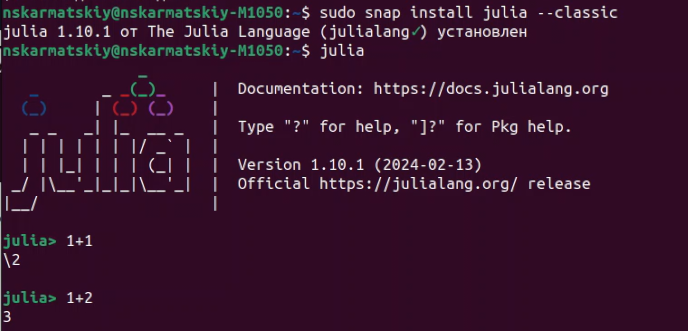
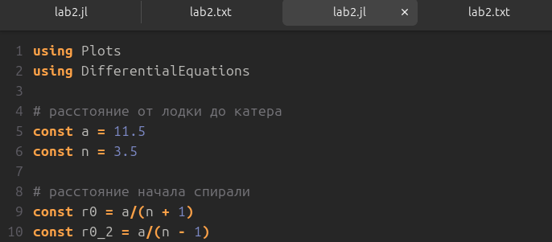
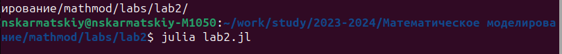
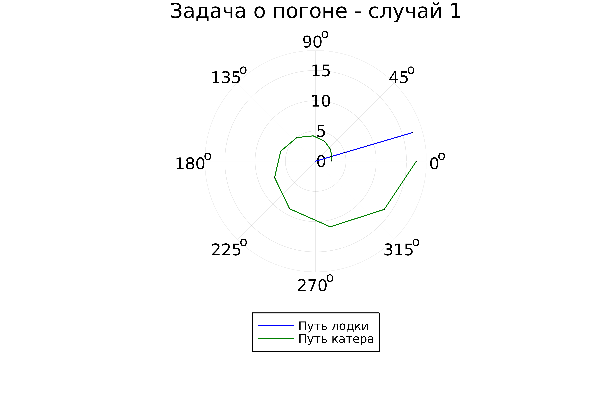
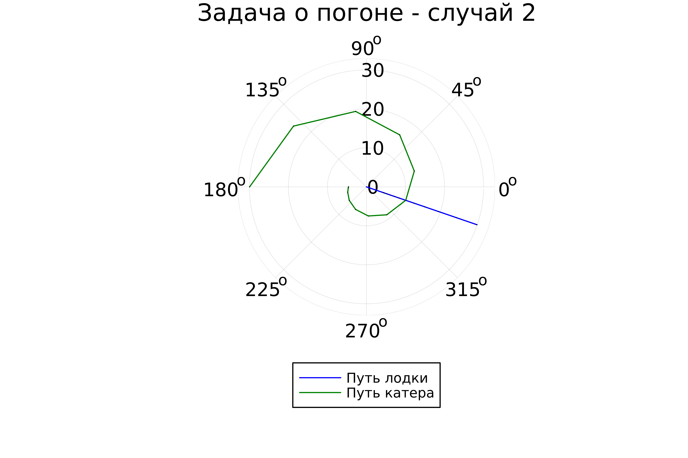

# Лабораторная работа №2

## "Задача о погоне"

Выполнил: Кармацкий Никита Сергеевич

НФИбд-01-21

---

# Цель работы:

Изучить основы языков программирования Julia и OpenModelica. Освоить библиотеки этих ЯП, которые используются для построения графиков и решения ДУ. Так же надо решить задачу о погоне.

---
# Задачи:

1. Записать уравнение, описывающее движение катера, с начальными условиями для двух случаев (в зависимости от расположения катера относительно лодки в начальный момент времени).
2. Построить траекторию движения катера и лодки для двух случаев.
3. Найти точку пересечения траектории катера и лодки
---

# Основные этапы выполнения работы

---

## 1. Математическая модель

Для начала постороили математическую модель для нашего варианта задачи. Зададим начальные значения. Катер обнаруживает лодку на расстояние 11,5 км от него. Скорость катера в 3,5 раза больше. 
a = 11,5
n = 3.5
Будем вести отсчет в полярных координатах. Полюс у нас это место обнаружения браконьеров.

---

Чтобы найти расстояние *x*(расстояние после которого катер начнет двигаться вокруг полюса), необходимо составить простое уравнение. Пусть через время катер и лодка окажутся на одном расстоянии от полюса. За это время лодка пройдет *x*, а *k+x* катер (или *k-x*, в зависимости от начального положения катера относительно полюса). Время, за которое они пройдут это расстояние, вычисляется как *x/v* или  *(k+x)/3.5v* (во втором случае *(k-x)/3.5v* ). Так как время одно и то же, то эти величины одинаковы. Составим уравнения и найдем растояние *x*

---

После того, как катер береговой охраны окажется на одном расстоянии от полюса, что и лодка, он должен сменить прямолинейную траекторию и начать двигаться вокруг полюса удаляясь от него со скоростью лодки v.
Для этого скорость катера раскладываем на радиальную и тангенциальную скорости

$$v_r = \frac{\mathrm{d} r}{\mathrm{d} t}$$ 
$$v_\tau = r\frac{\mathrm{d} \theta}{\mathrm{d} t} = {2r\over 3*\sqrt{5}}$$

---

## 2. Скачиваем Julia себе на устройство

**Для создания траектории движения будем использовать ЯП Julia, но для начало установим все нужное для нормального функционирования.**

Рис.1 Установка Julia

---

## 3. Пишем код для построения траектории на Julia

Рис.2 Код для траектории

---

## 4. Компилируем файл

**Для компиляции файла будем использовать команду: `julia lab2.jl`**

Рис.3 Начало компиляции кода

---

### 5. Просматриваем результаты работы программы

Первый рисунок - первый случай в задаче о погоне
Второй рисунок - второй случай в задаче о погоне

---

Рис.4 Второй случай

---

Рис.5 Второй случай

---

## Вывод:

Мы изучили основы языков программирования Julia и OpenModelica. Освоили библиотеки этих ЯП, которые используются для построения графиков и решения ДУ. Так же надо решили задачу о погоне.

---

# Спасибо за внимание
