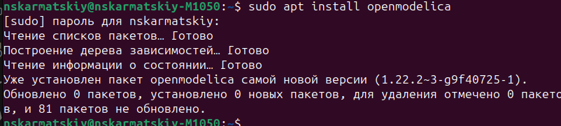
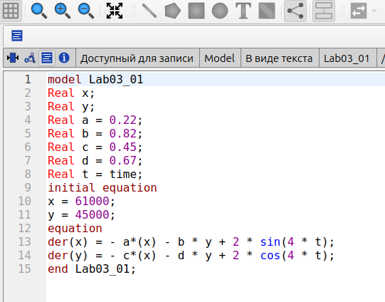
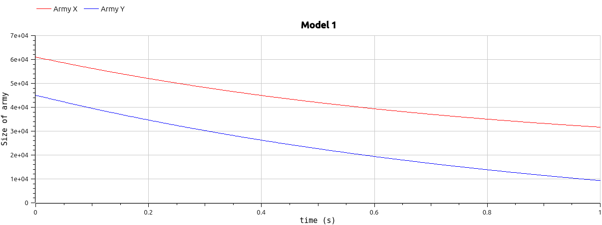
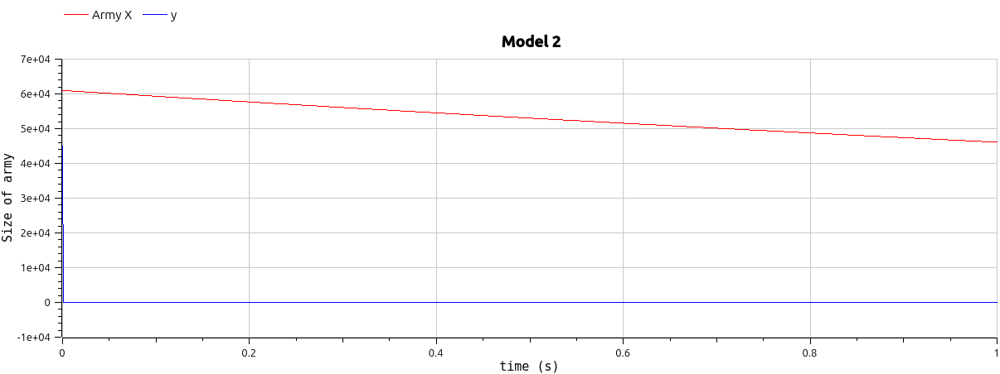
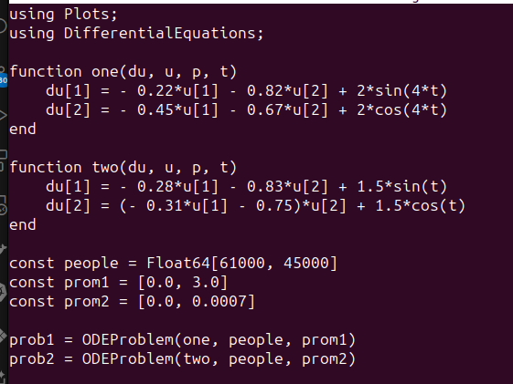
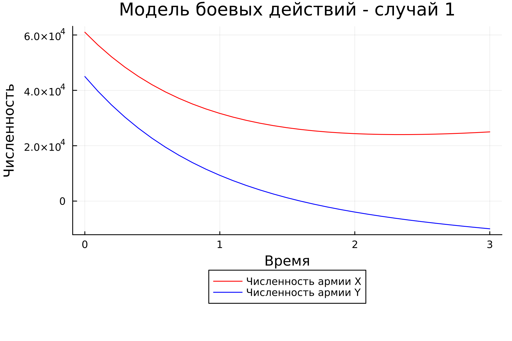
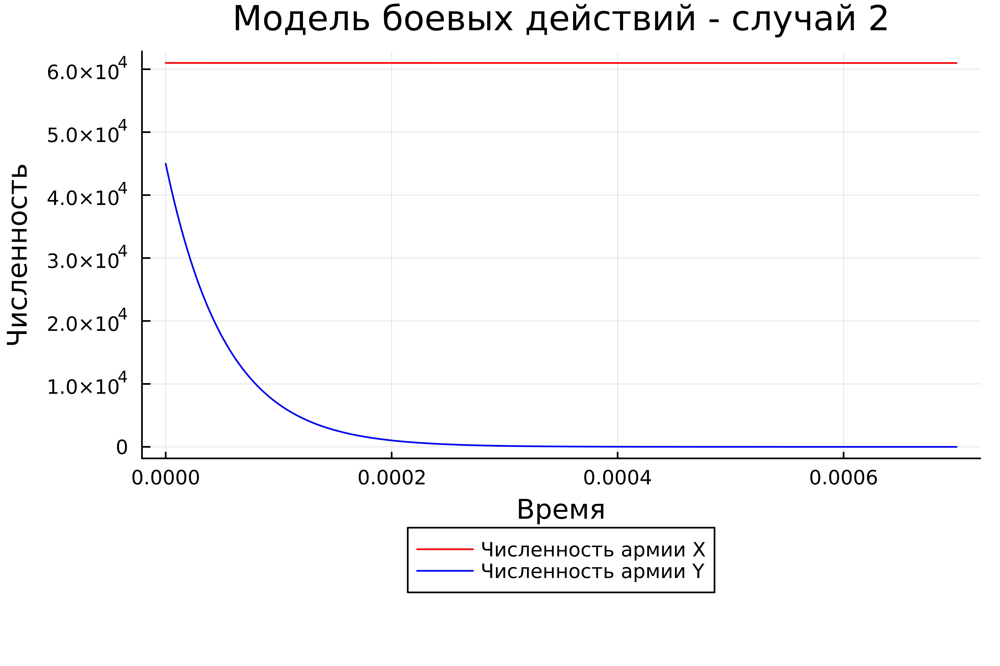

# Лабораторная работа №3

## "Модели Ланчестера"

Выполнил: Кармацкий Никита Сергеевич

НФИбд-01-21

---

# Цель работы:

Изучить модели боевых действий Ланчестера. Применить их на практике для решения задания лабораторной работы

---
# Теоретическая справка:
Законы Ланчестера (законы Осипова — Ланчестера) — математическая формула для расчета относительных сил пары сражающихся сторон — подразделений вооруженных сил

Уравнения Ланчестера — это дифференциальные уравнения, описывающие зависимость между силами сражающихся сторон A и D как функцию от времени, причем функция зависит только от A и D.
___

# Задание лабораторной работы:
Между страной Х и страной У идет война. Численность состава войск исчисляется от начала войны, и являются временными функциями $x(t)$ и $y(t)$. В начальный момент времени страна Х имеет армию численностью $61 000$ человек, а в распоряжении страны У армия численностью в $45 000$ человек. Для упрощения модели считаем, что коэффициенты $a$, $b$, $c$, $h$ постоянны. Также считаем $P(t)$ и $Q(t)$ непрерывными функциями. 
___
# Задачи:

Построить графики изменения численности войск армии Х и армии У для следующих случаев:

1. Модель боевых действий между регулярными войсками:

$$
{dx\over {dt}} = -0.22x(t)-0.82y(t)+2sin(4t)
$$

$$
{dy\over {dt}} = -0.45x(t)-0.67y(t)+2cos(4t)
$$

2. Модель ведение боевых действий с участием регулярных войск и партизанских отрядов:

$$
{dx\over {dt}} = -0.28x(t)-0.83y(t)+1.5sin(t)
$$

$$
{dy\over {dt}} = -0.31x(t)y(t)-0.75y(t)+1.5cos(t)
$$
---

# Основные этапы выполнения работы

---

## 1. Математическая модель

Численность регулярных войск определяется тремя факторами:

1. Cкорость уменьшения численности войск из-за причин, не связанных с боевыми действиями (болезни, травмы, дезертирство);
2. Cкорость потерь, обусловленных боевыми действиями противоборствующих сторон (что связанно с качеством стратегии, уровнем вооружения, профессионализмом солдат и т.п.);
3. Cкорость поступления подкрепления (задаётся некоторой функцией от времени).

---

## 2. Скачиваем OpenModelica себе на устройство

**Для создания траектории движения будем использовать ЯП OpenModelica, но для начало установим все нужное для нормального функционирования.**

Рис.1 Установка OpenModelica

---

## 3. Пишем код для построения траектории на OpenModelica

Рис.2 Код для построения моделей(openModelica)

---

### 4. Просматриваем результаты работы программы

Рис.3 Первая модель(OpenModelica)

---

Рис.4 Вторая модель(OpenModelica)

---

### 5. Пишем код для построения траектории на Julia

Рис. 6 Код на Julia

---

### 6. Просматриваем результат работы программы на Julia

---

Рис.7 Первая модель(Julia)

---

Рис.8 Вторая модель(Julia)

---
## Анализ полученных результатов. Сравнение языков.

Как видно из графиков, для первой модели, то есть двух регулярных армий, противостоящих друг другу, графики на Julia и OpenModelica идентичны (с поправкой на использование разных графических ресурсов, разный масштаб и т.д.).

Аналогичная ситуация верна и для графиков противостояния регулярной армии и армии партизанов, которые рассматривались во второй модели.

---

## Вывод:

По итогам лабораторной работы мы построили по две модели на языках Julia и OpenModelica. В ходе проделанной работы можно сделать вывод, что OpenModelica лучше приспособлен для моделирование процессов, протекающих во времени. Построение моделей боевых действий на языке OpenModelica занимает гораздо меньше строк и времени, чем аналогичное построение на языке Julia.

---

# Спасибо за внимание
