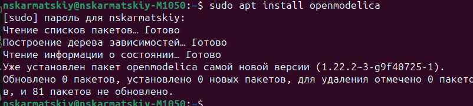
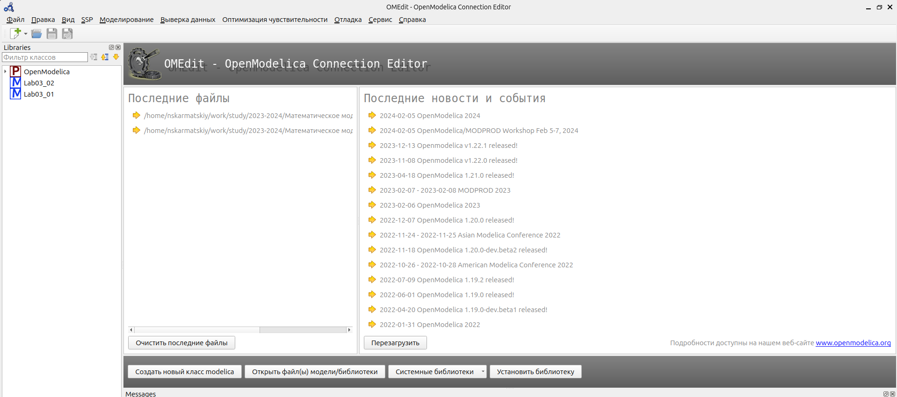
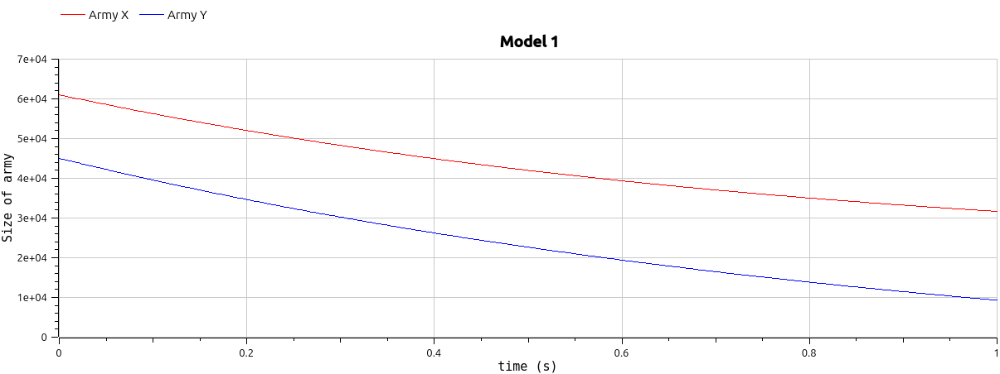
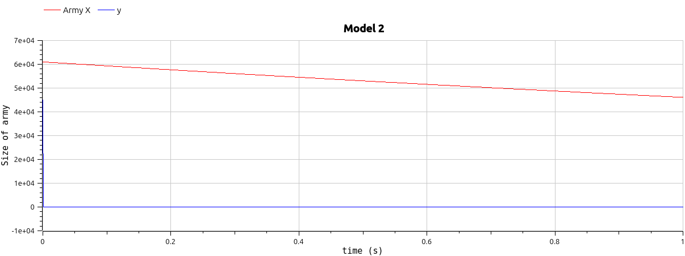

## РОССИЙСКИЙ УНИВЕРСИТЕТ ДРУЖБЫ НАРОДОВ им. Патриса Лулумбы

### Факультет физико-математических и естественных наук

### Кафедра теории вероятности и кибербезопасности

&nbsp;

&nbsp;

&nbsp;&nbsp;

##### ОТЧЕТ

##### ПО ЛАБОРАТОРНОЙ РАБОТЕ №3

*дисциплина: Математическое моделирование*

&nbsp;

Студент: Кармацкий Никита Сергеевич

Номер студ.билета: 1032210091

Группа: НФИбд-01-21

&nbsp;

##### Москва

2024 г.

&nbsp;
&nbsp;
&nbsp;
&nbsp;
&nbsp;
&nbsp;
&nbsp;
&nbsp;

&nbsp;
&nbsp;
&nbsp;

### Цель работы:

Изучить модели боевых действий Ланчестера. Применить их на практике для решения задания лабораторной работы

### Теоретическое введение

Законы Ланчестера (законы Осипова — Ланчестера) — математическая формула для расчета относительных сил пары сражающихся сторон — подразделений вооруженных сил

*Уравнения Ланчестера — это дифференциальные уравнения, описывающие зависимость между силами сражающихся сторон A и D как функцию от времени, причем функция зависит только от A и D.*

В 1916 году, в разгар первой мировой войны, Фредерик Ланчестер разработал систему дифференциальных уравнений для демонстрации соотношения между противостоящими силами. Среди них есть так называемые Линейные законы Ланчестера (первого рода или честного боя, для рукопашного боя или неприцельного огня) и Квадратичные законы Ланчестера (для войн начиная с XX века с применением прицельного огня, дальнобойных орудий, огнестрельного оружия). В связи с установленным приоритетом в англоязычной литературе наметилась тенденция перехода от фразы «модель Ланчестера» к «модели Осипова — Ланчестера». [4]

- В противоборстве могут принимать участие как регулярные войска,
  так и партизанские отряды. В общем случае главной характеристикой соперников
  являются численности сторон. Если в какой-то момент времени одна из
  численностей обращается в нуль, то данная сторона считается проигравшей (при
  условии, что численность другой стороны в данный момент положительна).

Рассмотривается три случая ведения боевых действий:

1. Боевые действия между регулярными войсками
2. Боевые действия с участием регулярных войск и партизанских отрядов
3. Боевые действия между партизанскими отрядами

# Задание

Вариант 32

Между страной Х и страной У идет война. Численность состава войск исчисляется от начала войны, и являются временными функциями $x(t)$ и $y(t)$. В
начальный момент времени страна Х имеет армию численностью $61 000$ человек, а в распоряжении страны У армия численностью в $45 000$ человек. Для упрощения модели считаем, что коэффициенты $a$, $b$, $c$, $h$ постоянны. Также считаем $P(t)$ и $Q(t)$ непрерывными функциями.

# Задачи:

Постройте графики изменения численности войск армии Х и армии У для следующих случаев:

1. Модель боевых действий между регулярными войсками:

$$
{dx\over {dt}} = -0.22x(t)-0.82y(t)+2sin(4t)
$$

$$
{dy\over {dt}} = -0.45x(t)-0.67y(t)+2cos(4t)
$$

2. Модель ведение боевых действий с участием регулярных войск и партизанских отрядов:

$$
{dx\over {dt}} = -0.28x(t)-0.83y(t)+1.5sin(t)
$$

$$
{dy\over {dt}} = -0.31x(t)y(t)-0.75y(t)+1.5cos(t)
$$

# Основные этапы выполнения работы

## Математическая модель

### Регулярная армия X против регулярной армии Y

Рассмотрим первый случай.
Численность регулярных войск определяется тремя факторами:

1. Cкорость уменьшения численности войск из-за причин, не связанных с боевыми действиями (болезни, травмы, дезертирство);
2. Cкорость потерь, обусловленных боевыми действиями противоборствующих сторон (что связанно с качеством стратегии, уровнем вооружения, профессионализмом солдат и т.п.);
3. Cкорость поступления подкрепления (задаётся некоторой функцией от времени).

В этом случае модель боевых действий между регулярными войсками описывается следующим образом:

$$
{dx\over {dt}} = -a(t)x(t)-b(t)y(t)+P(t)
$$

$$
{dy\over {dt}} = -c(t)x(t)-h(t)y(t)+Q(t)
$$

В первом пункте нами рассматривается как раз такая модель. Она является доработанной моделью Ланчестера, так его изначальная модель учитывала лишь члены $b(t)y(t)$ и $c(t)x(t)$, то есть, на потери за промежуток времени влияли лишь численность армий и "эффективность оружия" (коэффициенты $b(t)$ и $c(t)$).

$$
{dx\over {dt}} = -ax(t)-by(t)+P(t)
$$

$$
{dy\over {dt}} = -cx(t)-hy(t)+Q(t)
$$

Именно эти уравнения [3] и будут решать наши программы для выполнения первой части задания. В конце мы получим график кривой в декартовых координатах, где по оси $ox$ будет отображаться численность армии государства X, по оси $oy$ будет отображаться соответствующая численность армии Y. По тому, с какой осью пересечётся график, можно определить исход войны. Если ось $ox$ будет пересечена в положительных значениях, победа будет на стороне армии государства X (так как при таком раскладе численность армии Y достигла нуля при положительном значении численности армии X). Аналогичная ситуация для оси $oy$ и победы армии государства Y.

### Регулярная армия X против партизанской армии Y

Для второй части задания, то есть, для моделирования боевых действий между регулярной армией и партизанской армией, необходимо внести поправки в предыдущую модель. Считается, что темп потерь партизан, проводящих свои операции в разных местах на некоторой известной территории, пропорционален не только численности армейских соединений, но и численности самих партизан.

$$
{dx\over {dt}} = -a(t)x(t)-b(t)y(t)+P(t)
$$

$$
{dy\over {dt}} = -c(t)x(t)y(t)-h(t)y(t)+Q(t)
$$

Коэффициенты $a$, $b$, $c$ и $h$ всё так же будут положительными десятичными числами:

$$
{dx\over {dt}} = -ax(t)-by(t)+P(t)
$$

$$
{dy\over {dt}} = -cx(t)y(t)-hy(t)+Q(t)
$$

&nbsp;

## Решение с помощью кода

### 1. Julia

Листинг:

```
using Plots;
using DifferentialEquations;

function one(du, u, p, t)
    du[1] = - 0.22*u[1] - 0.82*u[2] + 2*sin(4*t)
    du[2] = - 0.45*u[1] - 0.67*u[2] + 2*cos(4*t)
end

function two(du, u, p, t)
    du[1] = - 0.28*u[1] - 0.83*u[2] + 1.5*sin(t)
    du[2] = (- 0.31*u[1] - 0.75)*u[2] + 1.5*cos(t)
end

const people = Float64[52000, 49000]
const prom1 = [0.0, 3.0]
const prom2 = [0.0, 0.0007]

prob1 = ODEProblem(one, people, prom1)
prob2 = ODEProblem(two, people, prom2)

sol1 = solve(prob1, dtmax=0.1)
sol2 = solve(prob2, dtmax=0.000001)

A1 = [u[1] for u in sol1.u]
A2 = [u[2] for u in sol1.u]
T1 = [t for t in sol1.t]
A3 = [u[1] for u in sol2.u]
A4 = [u[2] for u in sol2.u]
T2 = [t for t in sol2.t]

plt1 = plot(dpi = 300, legend= true, bg =:white)
plot!(plt1, xlabel="Время", ylabel="Численность", title="Модель боевых действий - случай 1", legend=:outerbottom)
plot!(plt1, T1, A1, label="Численность армии X", color =:red)
plot!(plt1, T1, A2, label="Численность армии Y", color =:blue)
savefig(plt1, "lab03_1.png")

plt2 = plot(dpi = 1200, legend= true, bg =:white)
plot!(plt2, xlabel="Время", ylabel="Численность", title="Модель боевых действий - случай 2", legend=:outerbottom)
plot!(plt2, T2, A3, label="Численность армии X", color =:red)
plot!(plt2, T2, A4, label="Численность армии Y", color =:blue)
savefig(plt2, "lab03_2.png")
```


Рис.1 График 1 на Julia

&nbsp;


Рис.2 График 2 на Julia

### 2. OpenModelica

Установим OpenModelica



Рис.3 Установка OpenModelica

Рабочая область OpenModelica



Рис.4 Рабочая область

```
model Lab03_01
Real x;
Real y;
Real a = 0.22;
Real b = 0.82;
Real c = 0.45;
Real d = 0.67;
Real t = time;
initial equation
x = 61000;
y = 45000;
equation
der(x) = - a*(x) - b * y + 2 * sin(4 * t);
der(y) = - c*(x) - d * y + 2 * cos(4 * t);
end Lab03_01;
```



Рис.5 График 1 на OpenModelica

&nbsp;

```
model Lab03_02
Real x;
Real y;
Real a = 0.28;
Real b = 0.83;
Real c = 0.31;
Real d = 0.75;
Real t = time;
initial equation
x = 61000;
y = 45000;
equation
der(x) = - a * x - b * y + 1.5 * sin(t);
der(y) = - c * x * y - d * y + 1.5 * cos(t);
end Lab03_02;
```



Рис.6 График 2 на OpenModelica

# Анализ полученных результатов. Сравнение языков.

Как видно из графиков, для первой модели, то есть двух регулярных армий, противостоящих друг другу, графики на Julia и OpenModelica идентичны (с поправкой на использование разных графических ресурсов, разный масштаб и т.д.).

Аналогичная ситуация верна и для графиков противостояния регулярной армии и армии партизанов, которые рассматривались во второй модели.

## Вывод:

По итогам лабораторной работы мы построили по две модели на языках Julia и OpenModelica. В ходе проделанной работы можно сделать вывод, что OpenModelica лучше приспособлен для моделирование процессов, протекающих во времени. Построение моделей боевых действий на языке OpenModelica занимает гораздо меньше строк и времени, чем аналогичное построение на языке Julia.

# Список литературы. Библиография

- Документация по Julia: https://docs.julialang.org/en/v1/
- Документация по OpenModelica: https://openmodelica.org/
- Решение дифференциальных уравнений: https://www.wolframalpha.com/
- Законы Ланчестера: https://ru.wikipedia.org/wiki/%D0%97%D0%B0%D0%BA%D0%BE%D0%BD%D1%8B_%D0%9E%D1%81%D0%B8%D0%BF%D0%BE%D0%B2%D0%B0_%E2%80%94_%D0%9B%D0%B0%D0%BD%D1%87%D0%B5%D1%81%D1%82%D0%B5%D1%80%D0%B0
