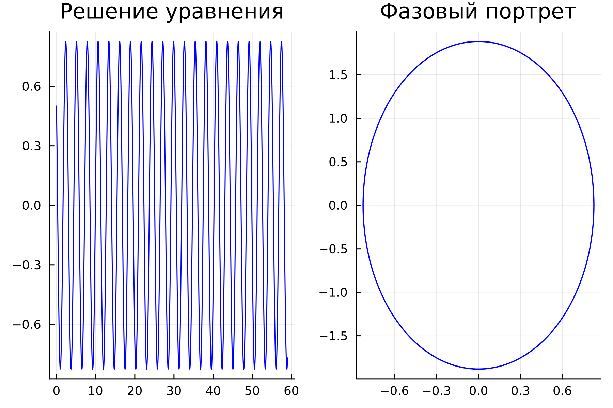
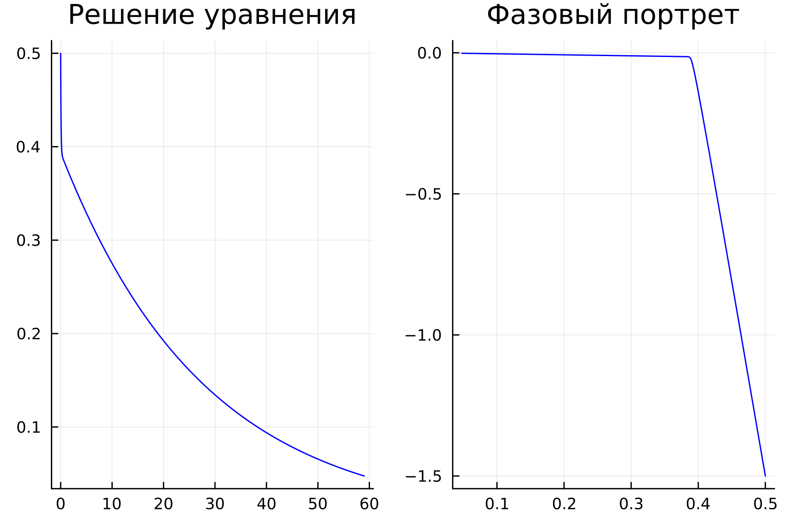
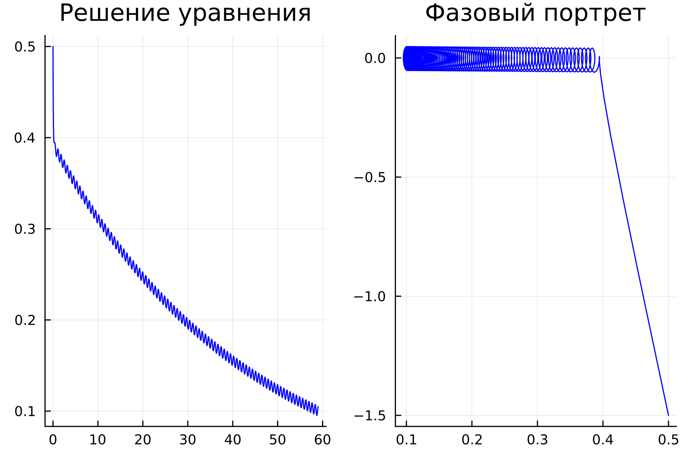
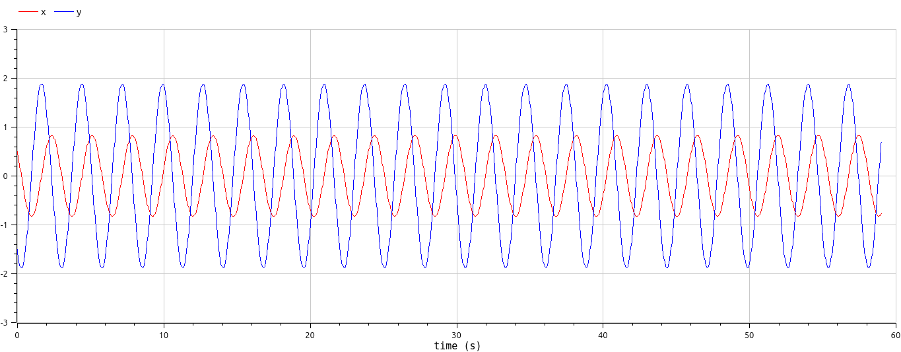
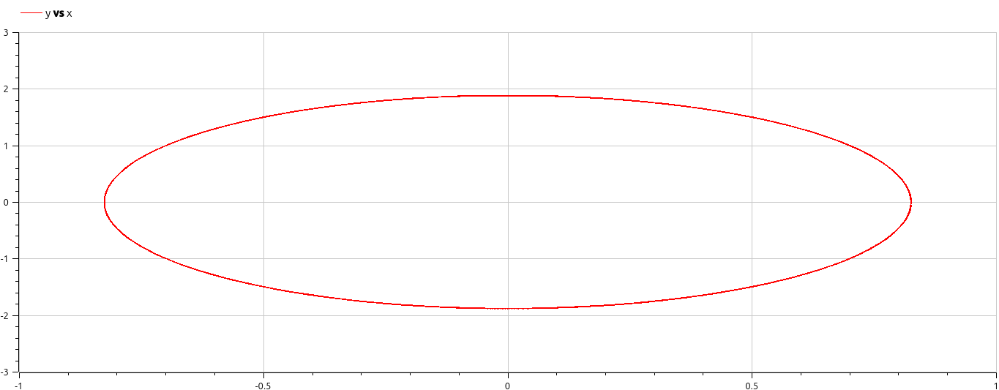
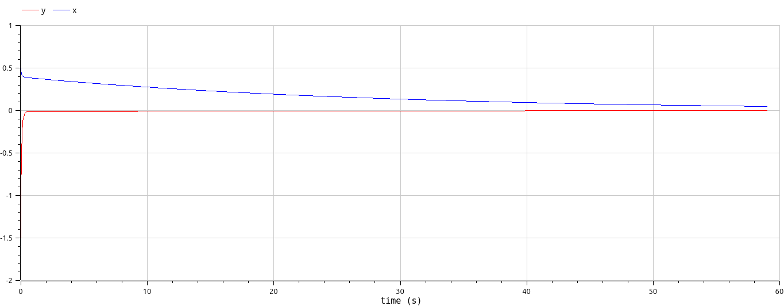
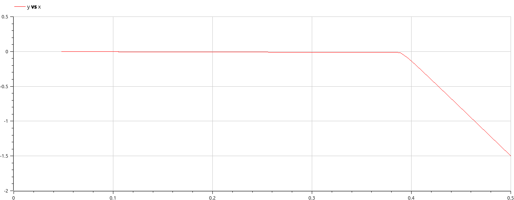
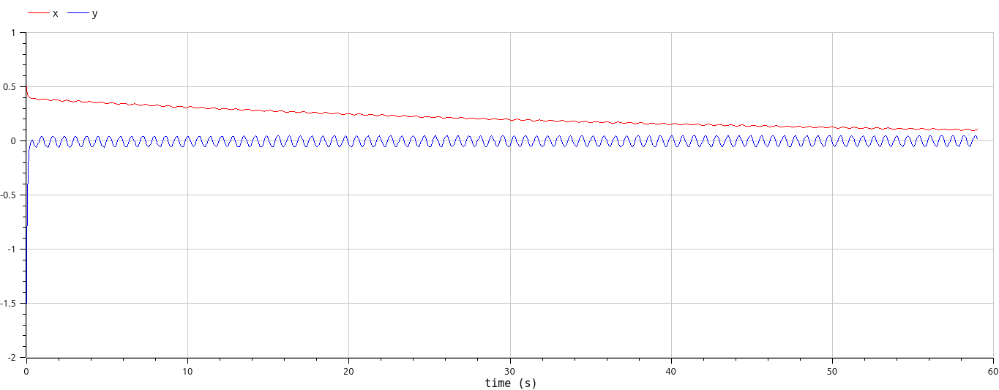
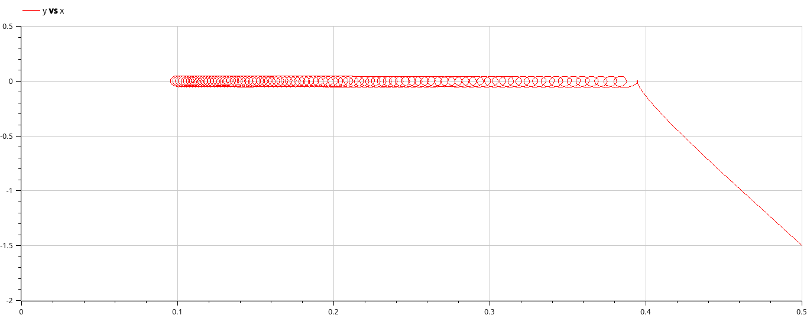

# Лабораторная работа №4

## "Модели гармонических колебаний"

Выполнил: Кармацкий Никита Сергеевич

НФИбд-01-21

---

# Цель работы:

Изучить понятие гармонического осциллятора, построить фазовый портрет и найти решение уравнения гармонического осциллятора.

---
# Теоретическая справка:
- Гармонический осциллятор [1] — система, которая при смещении из положения равновесия испытывает действие возвращающей силы F, пропорциональной смещению x.
- Гармоническое колебание [2] - колебание, в процессе которого величины, характеризующие движение (смещение, скорость, ускорение и др.), изменяются по закону синуса или косинуса (гармоническому закону).

---

# Математическая модель:
Движение грузика на пружинке, маятника, заряда в электрическом контуре, а также эволюция во времени многих систем в физике, химии, биологии и других науках при определенных предположениях можно описать одним и тем же дифференциальным уравнением, которое в теории колебаний выступает в качестве основной модели. Эта модель называется линейным гармоническим осциллятором.

---

Уравнение свободных колебаний гармонического осциллятора имеет следующий вид:
$$\ddot{x}+2\gamma\dot{x}+\omega_0^2=0$$

где $x$ - переменная, описывающая состояние системы (смещение грузика, заряд конденсатора и т.д.), $\gamma$ - параметр, характеризующий потери энергии (трение в механической системе, сопротивление в контуре), $\omega_0$ - собственная частота колебаний.
Это уравнение есть линейное однородное дифференциальное  уравнение второго порядка и оно является примером линейной динамической системы.

---
Значение фазовых координат $x, y$ в любой момент времени полностью определяет состояние системы. Решению уравнения движения как функции времени отвечает гладкая кривая в фазовой плоскости. Она называется фазовой траекторией. Если множество различных решений (соответствующих различным 
начальным условиям) изобразить на одной фазовой плоскости, возникает общая картина поведения системы. Такую картину, образованную набором фазовых траекторий, называют фазовым портретом.

___

# Задание лабораторной работы:
Вариант 32

Постройте фазовый портрет гармонического осциллятора и решение уравнения гармонического осциллятора для следующих случаев:

1. Колебания гармонического осциллятора без затуханий и без действий внешней силы $\ddot{x}+5.2=0$;
2. Колебания гармонического осциллятора c затуханием и без действий внешней силы $\ddot{x}+14\dot{x}+0.5x=0$
3. Колебания гармонического осциллятора c затуханием и под действием внешней силы $\ddot{x}+13\dot{x}+0.3x=0.8sin(9t)$

На интервале $t\in [0;59]$ (шаг $0.05$) с начальными условиями $x_0=0.5, y_0=-1.5$.
___

### Задачи:
1. Разобраться в понятии гармонического осциллятора

2. Ознакомиться с уравнением свободных колебаний гармонического осциллятора

3. Построить фазовый портрет гармонического осциллятора и решение уравнения на языках Julia и Open Modelica гармонического осциллятора для следующих случаев:
   
- Колебания гармонического осциллятора без затуханий и без действий внешней силы

- Колебания гармонического осциллятора c затуханием и без действий внешней силы

- Колебания гармонического осциллятора c затуханием и под действием внешней силы
  
---

# Основные этапы выполнения работы

---

## 1. Результаты выполнения кода на Julia. Первый случай

Рис.1 Первый случай на Julia

---

## 2. Результаты выполнения кода на Julia. Второй случай

Рис.2 Второй случай на Julia

---

### 3. Результаты выполнения кода на Julia. Третий случай

Рис.3 Третий случай на Julia

---

### 4. Результаты выполнения кода на OpenModelica. Первый случай

Рис. 4 OpenModelica. Первый случай. Решение уравнения

---

Рис. 5 OpenModelica. Первый случай. Фазовый портрет

---

### 5. Результаты выполнения кода на OpenModelica. Второй случай

Рис. 6 OpenModelica. Второй случай. Решение уравнения

---

Рис. 7 OpenModelica. Второй случай. Фазовый портрет

---

### 5. Результаты выполнения кода на OpenModelica. Третий случай

Рис. 8 OpenModelica. Третий случай. Решение уравнения

---

Рис. 9 OpenModelica. Третий случай. Фазовый портрет

---

## Анализ полученных результатов. Сравнение языков.

В итоге проделанной работы мы построили по три модели (включающих в себя два графика) на языках Julia и OpenModelica. Построение моделей колебания на языке OpenModelica занимает меньше строк, чем аналогичное построение на Julia.

---

## Вывод:

В ходе выполнения лабораторной работы были построены решения уравнения гармонического осциллятора и фазовые портреты гармонических колебаний без затухания, с затуханием и при действии внешней силы на языках Julia и Open Modelica.

---
## Список литературы. Библиография

- Документация по Julia: https://docs.julialang.org/en/v1/
- Документация по OpenModelica: https://openmodelica.org/
- Решение дифференциальных уравнений: https://www.wolframalpha.com/
- Бутиков И. Е. Собственные колебания линейного осциллятора. 2011.

---

# Спасибо за внимание
