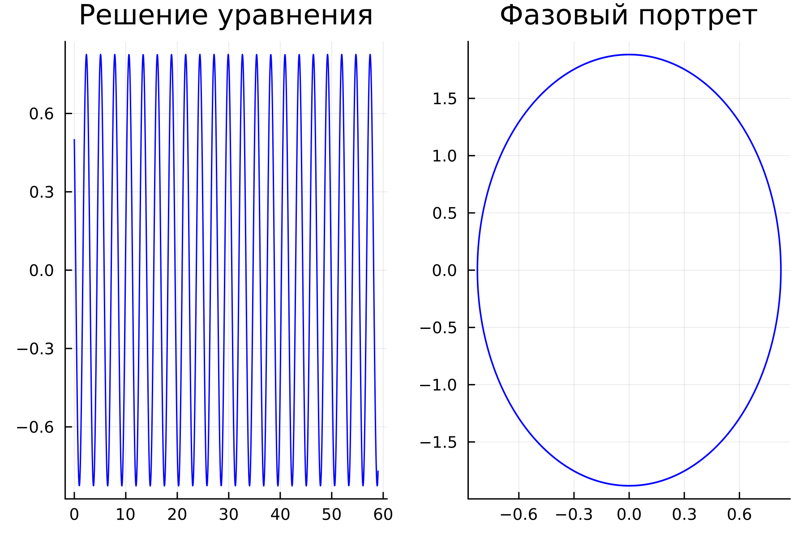
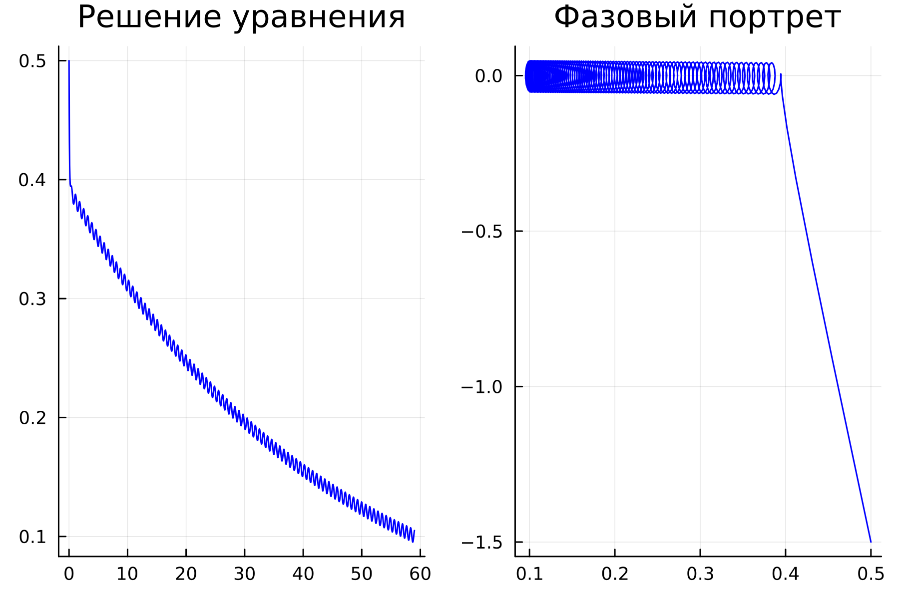
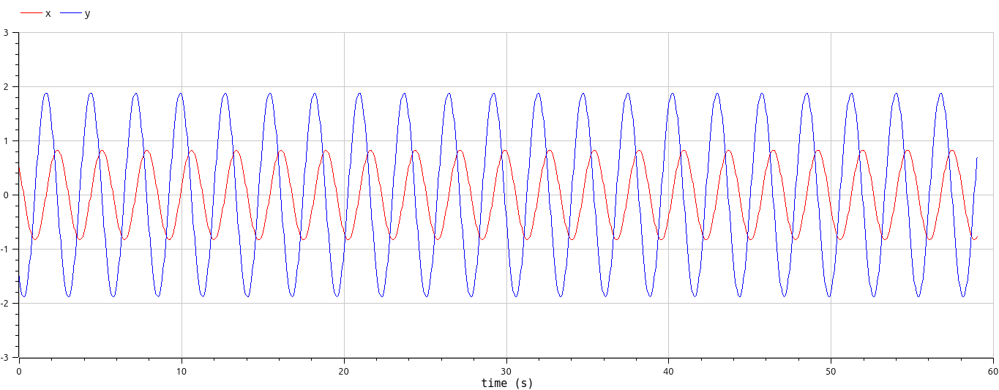
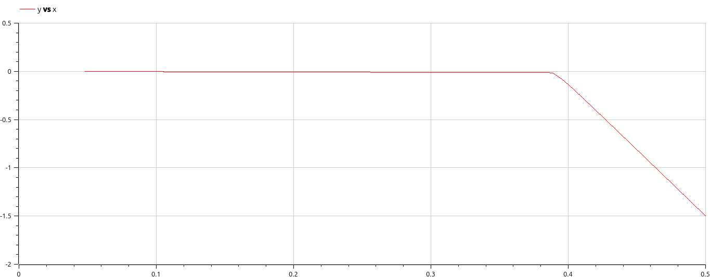
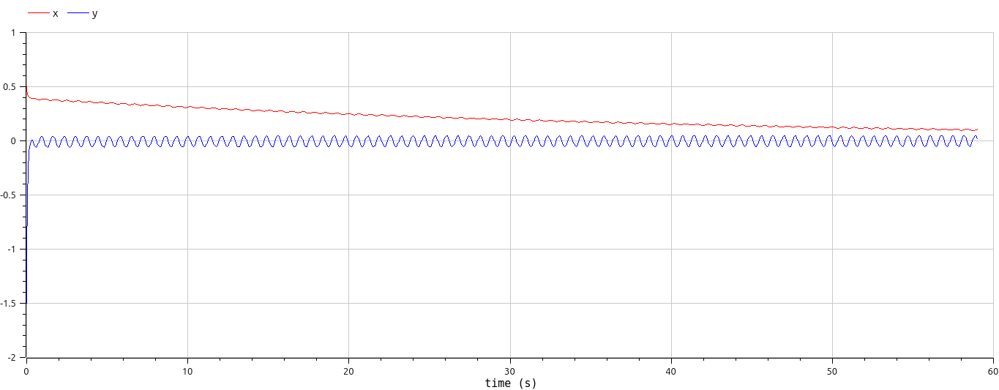

## РОССИЙСКИЙ УНИВЕРСИТЕТ ДРУЖБЫ НАРОДОВ им. Патриса Лулумбы

### Факультет физико-математических и естественных наук

### Кафедра теории вероятности и кибербезопасности

&nbsp;

&nbsp;

&nbsp;&nbsp;

##### ОТЧЕТ

##### ПО ЛАБОРАТОРНОЙ РАБОТЕ №4

*дисциплина: Математическое моделирование*

&nbsp;

Студент: Кармацкий Никита Сергеевич

Номер студ.билета: 1032210091

Группа: НФИбд-01-21

&nbsp;

##### Москва

2024 г.

&nbsp;
&nbsp;
&nbsp;
&nbsp;
&nbsp;
&nbsp;
&nbsp;
&nbsp;

&nbsp;
&nbsp;
&nbsp;

### Цель работы:

Изучить понятие гармонического осциллятора, построить фазовый портрет и найти решение уравнения гармонического осциллятора.

### Теоретическое введение

- Гармонический осциллятор [1] — система, которая при смещении из положения равновесия испытывает действие возвращающей силы F, пропорциональной смещению x.

- Гармоническое колебание [2] - колебание, в процессе которого величины, характеризующие движение (смещение, скорость, ускорение и др.), изменяются по закону синуса или косинуса (гармоническому закону).

Движение грузика на пружинке, маятника, заряда в электрическом контуре, а также эволюция во времени многих систем в физике, химии, биологии и других науках при определенных предположениях можно описать одним и тем же дифференциальным уравнением, которое в теории колебаний выступает в качестве основной модели. Эта модель называется линейным гармоническим осциллятором.
Уравнение свободных колебаний гармонического осциллятора имеет следующий вид:

$$\ddot{x}+2\gamma\dot{x}+\omega_0^2=0$$

где $x$- переменная, описывающая состояние системы (смещение грузика, заряд конденсатора и т.д.), $\gamma$ - параметр, характеризующий потери энергии (трение в механической системе, сопротивление в контуре), $\omega_0$ - собственная частота колебаний.
Это уравнение есть линейное однородное дифференциальное  уравнение второго порядка и оно является примером линейной динамической системы.

При отсутствии потерь в системе ( $\gamma=0$ ) получаем уравнение консервативного осциллятора энергия колебания которого сохраняется во времени.
$$\ddot{x}+\omega_0^2x=0$$

Для однозначной разрешимости уравнения второго порядка необходимо задать два начальных условия вида
 
$$
 \begin{cases}
	x(t_0)=x_0
	\\   
	\dot{x(t_0)}=y_0
 \end{cases}
$$

Уравнение второго порядка можно представить в виде системы двух уравнений первого порядка:
$$
 \begin{cases}
	x=y
	\\   
	y=-\omega_0^2x
 \end{cases}
$$

Начальные условия для системы примут вид:
$$
 \begin{cases}
	x(t_0)=x_0
	\\   
	y(t_0)=y_0
 \end{cases}
$$

Независимые	переменные	$x, y$	определяют	пространство,	в	котором «движется» решение. Это фазовое пространство системы, поскольку оно двумерно будем называть его фазовой плоскостью.

Значение фазовых координат $x, y$ в любой момент времени полностью определяет состояние системы. Решению уравнения движения как функции времени отвечает гладкая кривая в фазовой плоскости. Она называется фазовой траекторией. Если множество различных решений (соответствующих различным 
начальным условиям) изобразить на одной фазовой плоскости, возникает общая картина поведения системы. Такую картину, образованную набором фазовых траекторий, называют фазовым портретом.

# Задание

Вариант 32

Постройте фазовый портрет гармонического осциллятора и решение уравнения гармонического осциллятора для следующих случаев:

1. Колебания гармонического осциллятора без затуханий и без действий внешней силы $\ddot{x}+5.2=0$;
2. Колебания гармонического осциллятора c затуханием и без действий внешней силы $\ddot{x}+14\dot{x}+0.5x=0$
3. Колебания гармонического осциллятора c затуханием и под действием внешней силы $\ddot{x}+13\dot{x}+0.3x=0.8sin(9t)$

На интервале $t\in [0;59]$ (шаг $0.05$) с начальными условиями $x_0=0.5, y_0=-1.5$.


# Основные этапы выполнения работы

## Решение с помощью кода

### 1. Julia

Листинг первой программы:

```
using Plots
using DifferentialEquations

w = 5.2
g = 0.0
x₀ = 0.5
y₀ = -1.5


function ode_fn(du, u, p, t)
  x, y = u
  du[1] = u[2]
  du[2] = -w*u[1] - g*u[2]
end

v₀ = [x₀, y₀]
tspan = (0.0, 59.0)
prob = ODEProblem(ode_fn, v₀, tspan)
sol = solve(prob, dtmax=0.05)

X = [u[1] for u in sol.u]
Y = [u[2] for u in sol.u]
T = [t for t in sol.t]
plt = plot(
           layout=(1,2),
           dpi=300,
           legend=false)

plot!(
      plt[1],
      T,
      X,
      title="Решение уравнения",
      color=:blue)

plot!(
      plt[2],
      X,
      Y,
      title="Фазовый портрет",
      color=:blue)

savefig(plt, "pic1.png")
```



Рис.1 Первый случай на Julia

&nbsp;

Листинг второй программы:

```
using Plots
using DifferentialEquations

w = 0.5
g = 14.0
x₀ = 0.5
y₀ = -1.5


function ode_fn(du, u, p, t)
  x, y = u
  du[1] = u[2]
  du[2] = -w*u[1] - g*u[2]
end

v₀ = [x₀, y₀]
tspan = (0.0, 59.0)
prob = ODEProblem(ode_fn, v₀, tspan)
sol = solve(prob, dtmax=0.05)

X = [u[1] for u in sol.u]
Y = [u[2] for u in sol.u]
T = [t for t in sol.t]
plt = plot(
           layout=(1,2),
           dpi=300,
           legend=false)

plot!(
      plt[1],
      T,
      X,
      title="Решение уравнения",
      color=:blue)

plot!(
      plt[2],
      X,
      Y,
      title="Фазовый портрет",
      color=:blue)

savefig(plt, "pic2.png")
```


Рис.2 Второй случай на Julia

&nbsp;

Листинг третьей программы:

```
using Plots
using DifferentialEquations

w = 0.3
g = 13.0
x₀ = 0.5
y₀ = -1.5


function ode_fn(du, u, p, t)
  x, y = u
  du[1] = u[2]
  du[2] = -w*u[1] - g*u[2] + 0.8*sin(9*t)
end

v₀ = [x₀, y₀]
tspan = (0.0, 59.0)
prob = ODEProblem(ode_fn, v₀, tspan)
sol = solve(prob, dtmax=0.05)

X = [u[1] for u in sol.u]
Y = [u[2] for u in sol.u]
T = [t for t in sol.t]
plt = plot(
           layout=(1,2),
           dpi=300,
           legend=false)

plot!(
      plt[1],
      T,
      X,
      title="Решение уравнения",
      color=:blue)

plot!(
      plt[2],
      X,
      Y,
      title="Фазовый портрет",
      color=:blue)

savefig(plt, "pic3.png")
```



Рис.3 Третий случай на Julia

### 2. OpenModelica

Первый листинг OpenModelica

```
model Lab4_1
Real x;
Real y;
Real w = 5.2;
Real g = 0.0;
Real t = time;
initial equation
x = 0.5;
y = -1.5;
equation
der(x) = y;
der(y) = -w*x - g*y;
end Lab4_1;
```



Рис.4 Решение уравнения на OM. Первый случай

&nbsp;


Рис.5 Фазовый портрет на OM. Первый случай

&nbsp;

Второй листинг OpenModelica

```
model Lab4_2
Real x;
Real y;
Real w = 0.5;
Real g = 14.0;
Real t = time;
initial equation
x = 0.5;
y = -1.5;
equation
der(x) = y;
der(y) = -w*x - g*y;
end Lab4_2;
```


Рис.6 Решение уравнения на OM. Второй случай

&nbsp;



Рис.7 Фазовый портрет на OM. Второй случай

&nbsp;

Третий листинг OpenModelica

```
model Lab4_3
Real x;
Real y;
Real w = 0.3;
Real g = 13.0;
Real t = time;
initial equation
x = 0.5;
y = -1.5;
equation
der(x) = y;
der(y) = -w*x - g*y + 0.8*sin(9*t);
end Lab4_3;
```



Рис.8 Решение уравнения на OM. Третий случай

&nbsp;


Рис.9 Фазовый портрет на OM. Третий случай

&nbsp;

# Анализ полученных результатов. Сравнение языков.

В итоге проделанной работы мы построили по три модели (включающих в себя два графика) на языках Julia и OpenModelica. Построение моделей колебания на языке OpenModelica занимает меньше строк, чем аналогичное построение на Julia.

## Вывод:

В ходе выполнения лабораторной работы были построены решения уравнения гармонического осциллятора и фазовые портреты гармонических колебаний без затухания, с затуханием и при действии внешней силы на языках Julia и Open Modelica.

# Список литературы. Библиография

- Документация по Julia: https://docs.julialang.org/en/v1/
- Документация по OpenModelica: https://openmodelica.org/
- Решение дифференциальных уравнений: https://www.wolframalpha.com/
- Бутиков И. Е. Собственные колебания линейного осциллятора. 2011.