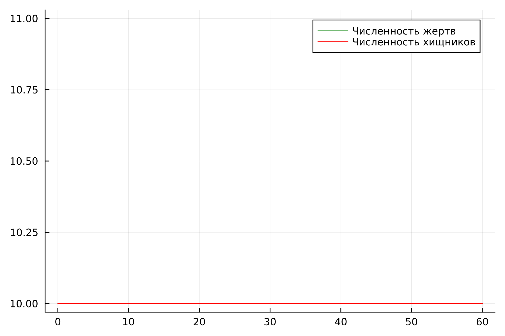

# Лабораторная работа №5

## "Модель Лотки-Вольтерры"

Выполнил: Кармацкий Никита Сергеевич

НФИбд-01-21

---

# Цель работы:

Изучить модель Лотки-Вольтерры тип "Хищник - Жертва". Применить ее на практике для решения задания лабораторной работы

---

# Теоретическая справка:

- Модель Лотки—Вольтерры — модель взаимодействия двух видов типа «хищник — жертва», названная в честь её авторов, которые предложили модельные уравнения независимо друг от друга. Такие уравнения можно использовать для моделирования систем «хищник — жертва», «паразит — хозяин», конкуренции и других видов взаимодействия между двумя видами.

---

Данная двувидовая модель основывается на
следующих предположениях:

1. Численность популяции жертв x и хищников y зависят только от времени (модель не учитывает пространственное распределение популяции на занимаемой территории)
2. В отсутствии взаимодействия численность видов изменяется по модели Мальтуса, при этом число жертв увеличивается, а число хищников падает
3. Естественная смертность жертвы и естественная рождаемость хищника считаются несущественными
4. Эффект насыщения численности обеих популяций не учитывается
5. Скорость роста численности жертв уменьшается пропорционально численности хищников

---

# Математическая модель:

$$
\begin{cases}
	\frac{dx}{dt} = (-ax(t) + by(t)x(t))
	\\   
	\frac{dy}{dt} = (cy(t) - dy(t)x(t))
 \end{cases}
$$

В этой модели $x$ – число жертв, $y$ - число хищников.
Коэффициент $a$ описывает скорость естественного прироста числа жертв в отсутствие хищников, $с$ - естественное вымирание хищников, лишенных пищи в виде жертв.
Вероятность взаимодействия жертвы и хищника считается пропорциональной как количеству жертв, так и числу самих хищников ($xy$).
Каждый акт взаимодействия уменьшает популяцию жертв, но способствует увеличению популяции хищников (члены $-bxy$ и $dxy$ в правой части уравнения).

---

Математический анализ этой (жёсткой) модели показывает, что имеется стационарное состояние, всякое же другое начальное состояние приводит
к периодическому колебанию численности как жертв, так и хищников, так что по прошествии некоторого времени такая система вернётся в изначальное состояние.

---

Стационарное состояние системы (положение равновесия, не зависящее от времени решения) будет находиться
в точке $x_0=\frac{c}{d}, y_0=\frac{a}{b}$. Если начальные значения задать в стационарном состоянии $x(0) = x_0, y(0) = y_0$, то в любой момент времени
численность популяций изменяться не будет. При малом отклонении от положения равновесия численности как хищника, так и жертвы с течением времени не
возвращаются к равновесным значениям, а совершают периодические колебания вокруг стационарной точки. Амплитуда колебаний и их период определяется
начальными значениями численностей $x(0), y(0)$. Колебания совершаются в противофазе.

---

# Задание лабораторной работы:

Вариант 32

Для модели «хищник-жертва»:

$$
\begin{cases}
	\frac{dx}{dt} = (-0.25x(t) + 0.025y(t)x(t))
	\\   
	\frac{dy}{dt} = (0.45y(t) - 0.045y(t)x(t))
 \end{cases}
$$

Постройте график зависимости численности хищников от численности жертв,
а также графики изменения численности хищников и численности жертв при
следующих начальных условиях: $x_0=8, y_0=11$. Найдите стационарное
состояние системы.

---

# Задачи:

1. Построить график зависимости численности хищников от численности жертв
2. Построить график зависимости численности хищников и численности жертв от времени
3. Найти стационарное состояние системы

---

# Основные этапы выполнения работы

---

## 1. Результат выполнения кода на Julia. График зависимости численности хищников от численности жертв

Рис.1 График зависимости численности хищников от численности жертв на Julia

---

## 2. Результат выполнения кода на Julia. График зависимости численности хищников и численности жертв от времени

Рис.2 График зависимости численности хищников и численности жертв от времени на Julia

---

## 3. Результат выполнения кода на Julia. Стационарное состояние системы

Рис.3 Стационарное состояние системы на Julia

---

## 4. Результат выполнения кода на OpenModelica. График зависимости численности хищников от численности жертв

Рис.4 График зависимости численности хищников от численности жертв на OpenModelica

---

## 5. Результат выполнения кода на OpenModelica. График зависимости численности хищников и численности жертв от времени

Рис.5 График зависимости численности хищников и численности жертв от времени на OpenModelica

---

## 6. Результат выполнения кода на OpenModelica. Стационарное состояние системы

Рис.6 Стационарное состояние системы на OpenModelica

---

## Анализ полученных результатов. Сравнение языков.

В итоге проделанной работы мы построили график зависимости численности хищников от численности жертв, а также графики изменения численности хищников и численности жертв на языках Julia и OpenModelica. Построение модели хищник-жертва на языке openModelica занимает меньше строк, чем аналогичное построение на Julia.

---

## Вывод:

В ходе выполнения лабораторной работы была изучена модель хищник-жертва и построена модель на языках Julia и Open Modelica.

---

# Список литературы. Библиография

- Документация по Julia: https://docs.julialang.org/en/v1/
- Документация по OpenModelica: https://openmodelica.org/
- Решение дифференциальных уравнений: https://www.wolframalpha.com/
- Модель Лотки—Вольтерры: https://math-it.petrsu.ru/users/semenova/MathECO/Lections/Lotka_Volterra.pdf

---

# Спасибо за внимание
