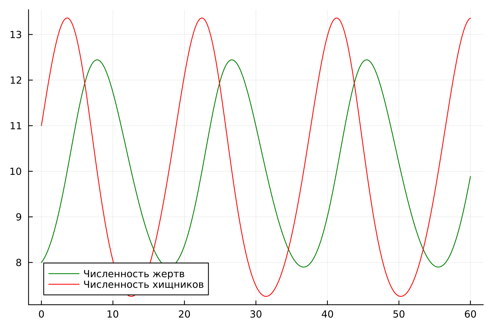
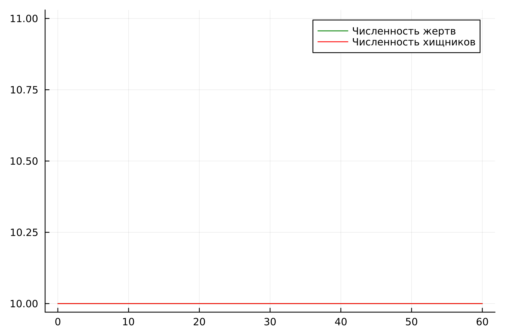
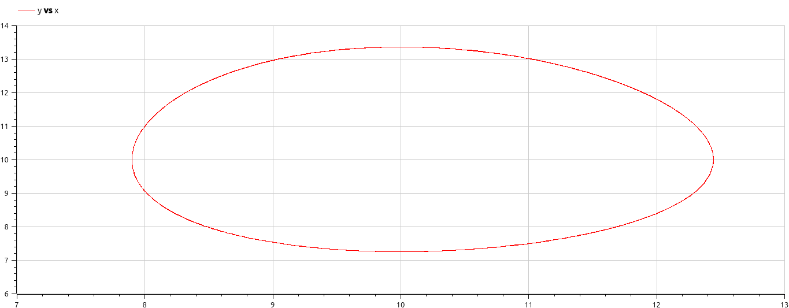
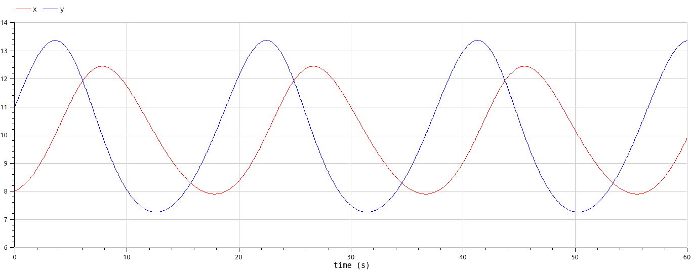
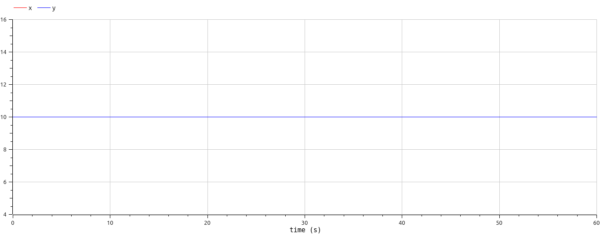

## РОССИЙСКИЙ УНИВЕРСИТЕТ ДРУЖБЫ НАРОДОВ им. Патриса Лулумбы

### Факультет физико-математических и естественных наук

### Кафедра теории вероятности и кибербезопасности

&nbsp;

&nbsp;

&nbsp;&nbsp;

##### ОТЧЕТ

##### ПО ЛАБОРАТОРНОЙ РАБОТЕ №5

*дисциплина: Математическое моделирование*

&nbsp;

Студент: Кармацкий Никита Сергеевич

Номер студ.билета: 1032210091

Группа: НФИбд-01-21

&nbsp;

##### Москва

2024 г.

&nbsp;
&nbsp;
&nbsp;
&nbsp;
&nbsp;
&nbsp;
&nbsp;
&nbsp;

&nbsp;
&nbsp;
&nbsp;

### Цель работы:

Изучить модель Лотки-Вольтерры тип "Хищник - Жертва". Применить их на практике для решения задания лабораторной работы

### Теоретическое введение

- Модель Лотки—Вольтерры — модель взаимодействия двух видов типа «хищник — жертва», названная в честь её авторов, которые предложили модельные уравнения независимо друг от друга. Такие уравнения можно использовать для моделирования систем «хищник — жертва», «паразит — хозяин», конкуренции и других видов взаимодействия между двумя видами.

Данная двувидовая модель основывается на
следующих предположениях:

1. Численность популяции жертв x и хищников y зависят только от времени (модель не учитывает пространственное распределение популяции на занимаемой территории)

2. В отсутствии взаимодействия численность видов изменяется по модели Мальтуса, при этом число жертв увеличивается, а число хищников падает

3. Естественная смертность жертвы и естественная рождаемость хищника считаются несущественными

4. Эффект насыщения численности обеих популяций не учитывается

5. Скорость роста численности жертв уменьшается пропорционально численности хищников

$$
 \begin{cases}
	\frac{dx}{dt} = (-ax(t) + by(t)x(t))
	\\   
	\frac{dy}{dt} = (cy(t) - dy(t)x(t))
 \end{cases}
$$

В этой модели $x$ – число жертв, $y$ - число хищников.
Коэффициент $a$ описывает скорость естественного прироста числа жертв в отсутствие хищников, $с$ - естественное вымирание хищников, лишенных пищи в виде жертв.
Вероятность взаимодействия жертвы и хищника считается пропорциональной как количеству жертв, так и числу самих хищников ($xy$).
Каждый акт взаимодействия уменьшает популяцию жертв, но способствует увеличению популяции хищников (члены $-bxy$ и $dxy$ в правой части уравнения).

Математический анализ этой (жёсткой) модели показывает, что имеется стационарное состояние, всякое же другое начальное состояние приводит
к периодическому колебанию численности как жертв, так и хищников, так что по прошествии некоторого времени такая система вернётся в изначальное состояние.

Стационарное состояние системы (положение равновесия, не зависящее от времени решения) будет находиться
в точке $x_0=\frac{c}{d}, y_0=\frac{a}{b}$. Если начальные значения задать в стационарном состоянии $x(0) = x_0, y(0) = y_0$, то в любой момент времени
численность популяций изменяться не будет. При малом отклонении от положения равновесия численности как хищника, так и жертвы с течением времени не
возвращаются к равновесным значениям, а совершают периодические колебания вокруг стационарной точки. Амплитуда колебаний и их период определяется
начальными значениями численностей $x(0), y(0)$. Колебания совершаются в противофазе.

# Задание

Вариант 32

Для модели «хищник-жертва»:

$$
 \begin{cases}
	\frac{dx}{dt} = (-0.25x(t) + 0.025y(t)x(t))
	\\   
	\frac{dy}{dt} = (0.45y(t) - 0.045y(t)x(t))
 \end{cases}
$$

Постройте график зависимости численности хищников от численности жертв,
а также графики изменения численности хищников и численности жертв при
следующих начальных условиях: $x_0=8, y_0=11$. Найдите стационарное
состояние системы.

# Задачи:

1. Построить график зависимости численности хищников от численности жертв

2. Построить график зависимости численности хищников и численности жертв от времени

3. Найти стационарное состояние системы

# Основные этапы выполнения работы

## Решение с помощью кода

### 1. Julia

Листинг первой программы на julia:

```
using Plots
using DifferentialEquations

x0 = 8
y0 = 11

a = 0.25
b = 0.025
c = 0.45
d = 0.045

function ode_fn(du, u, p , t)
	x, y = u
	du[1] = -a*u[1] + b*u[1]*u[2]
	du[2] = c*u[2] - d*u[1]*u[2]
end
v0 = [x0, y0]
tspan = (0.0, 60.0)
prob = ODEProblem(ode_fn, v0, tspan)
sol = solve(prob, dtmax=0.05)
X = [u[1] for u in sol.u]
Y = [u[2] for u in sol.u]
T = [t for t in sol.t]

plt = plot(
  dpi=300,
  legend=false)

plot!(
  plt,
  X,
  Y,
  label="Зависимость численности хищников от численности жертв",
  color=:red)

savefig(plt, "5_1.png")

plt2 = plot(
  dpi=300,
  legend=true)

plot!(
  plt2,
  T,
  X,
  label="Численность жертв",
  color=:green)

plot!(
  plt2,
  T,
  Y,
  label="Численность хищников",
  color=:red)

savefig(plt2, "5_2.png")

```


Рис.1 Зависимость от численности жертв на Julia

&nbsp;



Рис.2 Зависимость от времени на Julia

&nbsp;

Листинг второй программы на julia:

```
using Plots
using DifferentialEquations

x0 = 8
y0 = 11

a = 0.25
b = 0.025
c = 0.45
d = 0.045

function ode_fn(du, u, p , t)
	x, y = u
	du[1] = -a*u[1] + b*u[1]*u[2]
	du[2] = c*u[2] - d*u[1]*u[2]
end
v0 = [x0, y0]
tspan = (0.0, 60.0)
prob = ODEProblem(ode_fn, v0, tspan)
sol = solve(prob, dtmax=0.05)
X = [u[1] for u in sol.u]
Y = [u[2] for u in sol.u]
T = [t for t in sol.t]

plt = plot(
  dpi=300,
  legend=false)

plot!(
  plt,
  X,
  Y,
  label="Зависимость численности хищников от численности жертв",
  color=:red)

savefig(plt, "5_1.png")

plt2 = plot(
  dpi=300,
  legend=true)

plot!(
  plt2,
  T,
  X,
  label="Численность жертв",
  color=:green)

plot!(
  plt2,
  T,
  Y,
  label="Численность хищников",
  color=:red)

savefig(plt2, "5_2.png")

```



Рис.3 График стационарного состояния на Julia


### 2. OpenModelica

Первый листинг программы на OpenModelica

```
model Lab5_1
Real a = 0.25;
Real b = 0.025;
Real c = 0.45;
Real d = 0.045;
Real x;
Real y;
initial equation
x = 8;
y = 11;
equation
der(x) = -a*x + b*x*y;
der(y) = c*y - d*x*y;
annotation(experiment(StartTime = 0, StopTime = 60, Interval = 0.05));
end Lab5_1;
```



Рис.4 График зависимости числености хищников от жертв на OpenModelica

&nbsp;



Рис.5 График зависимости от времени на OpenModelica

&nbsp;

```
model Lab5_2
Real a = 0.25;
Real b = 0.025;
Real c = 0.45;
Real d = 0.045;
Real x;
Real y;
initial equation
x = c/d;
y = a/b;
equation
der(x) = -a*x + b*x*y;
der(y) = c*y - d*x*y;
annotation(experiment(StartTime = 0, StopTime = 60, Interval = 0.05));
end Lab5_2;
```



Рис.6 График стационарного случая на OpenModelica

# Анализ полученных результатов. Сравнение языков.

В итоге проделанной работы мы построили график зависимости численности хищников от численности жертв, а также графики изменения численности хищников и численности жертв на языках Julia и OpenModelica. Построение модели хищник-жертва на языке openModelica занимает меньше строк, чем аналогичное построение на Julia.

## Вывод:

В ходе выполнения лабораторной работы была изучена модель хищник-жертва и построена модель на языках Julia и Open Modelica.

# Список литературы. Библиография

- Документация по Julia: https://docs.julialang.org/en/v1/
- Документация по OpenModelica: https://openmodelica.org/
- Решение дифференциальных уравнений: https://www.wolframalpha.com/
- Модель Лотки—Вольтерры: https://math-it.petrsu.ru/users/semenova/MathECO/Lections/Lotka_Volterra.pdf