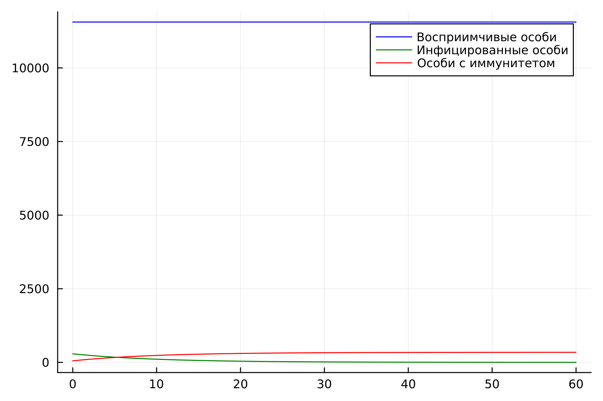
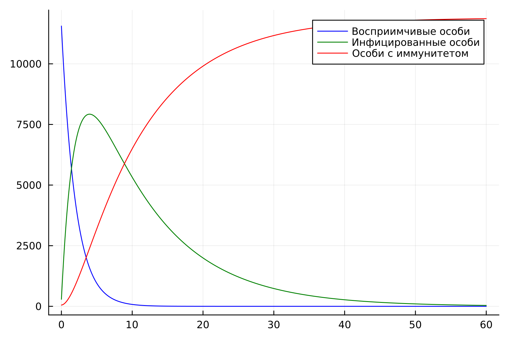
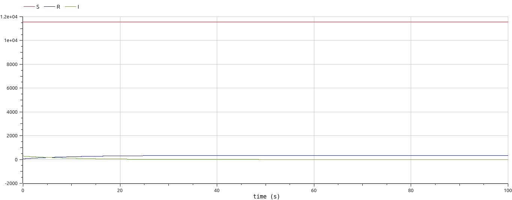
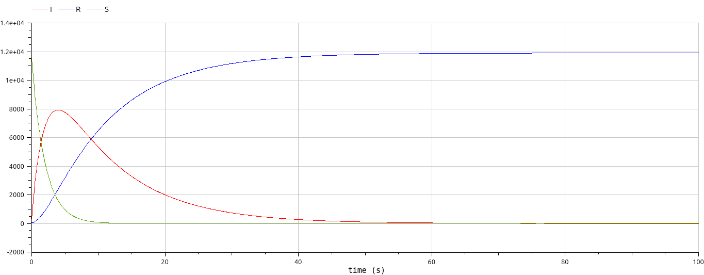

# Лабораторная работа №6

## "Модель эпидемии"

Выполнил: Кармацкий Никита Сергеевич

НФИбд-01-21

---

# Цель работы:

Изучить модель эпидемии. Применить её на практике для решения задания лабораторной работы

---
# Теоретическая справка. Математическая модель.
Рассмотрим простейшую модель эпидемии. Предположим, что некая популяция, состоящая из $N$ особей, (считаем, что популяция изолирована) подразделяется на три группы. Первая группа - это восприимчивые к болезни, но пока здоровые особи, обозначим их через $S(t)$. Вторая группа – это число инфицированных особей, которые также при этом являются распространителями инфекции, обозначим их $I(t)$. А третья группа, обозначающаяся через $R(t)$ – это здоровые особи с иммунитетом к болезни. 
До того, как число заболевших не превышает критического значения $I^*$, считаем, что все больные изолированы и не заражают здоровых. Когда $I(t)> I^*$, тогда инфицирование способны заражать восприимчивых к болезни особей.

---
Таким образом, скорость изменения числа $S(t)$ меняется по следующему закону:

$$
\frac{dS}{dt}=
 \begin{cases}
	-\alpha S &\text{,если $I(t) > I^*$}
	\\   
	0 &\text{,если $I(t) \leq I^*$}
 \end{cases}
$$

---
Поскольку каждая восприимчивая к болезни особь, которая, в конце концов, заболевает, сама становится инфекционной, то скорость изменения числа инфекционных особей представляет разность за единицу времени между заразившимися и теми, кто уже болеет и лечится, то есть:

$$
\frac{dI}{dt}=
 \begin{cases}
	\alpha S -\beta I &\text{, если $I(t) > I^*$}
	\\   
	-\beta I &\text{, если $I(t) \leq I^*$}
 \end{cases}
$$

---
А скорость изменения выздоравливающих особей (при этом приобретающие иммунитет к болезни):

$$\frac{dR}{dt} = \beta I$$

Постоянные пропорциональности $\alpha, \beta$ - это коэффициенты заболеваемости и выздоровления соответственно. Для того, чтобы решения соответствующих уравнений определялось однозначно, необходимо задать начальные условия. Считаем, что на начало эпидемии в момент времени $t=0$ нет особей с иммунитетом к болезни $R(0)=0$, а число инфицированных и восприимчивых к болезни особей $I(0)$ и $S(0)$ соответственно. Для анализа картины протекания эпидемии необходимо рассмотреть два случая:  $I(0) \leq I^*$ и  $I(0)>I^*$
___

# Задание лабораторной работы:
Вариант 32

На одном острове вспыхнула эпидемия. Известно, что из всех проживающих
на острове $(N=11 900)$ в момент начала эпидемии $(t=0)$ число заболевших людей (являющихся распространителями инфекции) $I(0)=290$, А число здоровых людей с иммунитетом к болезни $R(0)=52$. Таким образом, число людей восприимчивых к болезни, но пока здоровых, в начальный момент времени $S(0)=N-I(0)- R(0)$. Постройте графики изменения числа особей в каждой из трех групп.

___
# Задачи:

Построить графики изменения числа особей в каждой из трех групп $S$, $I$, $R$. Рассмотреть, как будет протекать эпидемия в случаях:

1.	$I(0)\leq I^*$

2.	$I(0)>I^*$

---

# Основные этапы выполнения работы

---

## 1. Результат работы программы для первого случая. Julia

Рис.1 График первого случая на Julia

---

## 2. Результат работы программы для второго случая. Julia

Рис.2 График второго случая на Julia

---

## 3. Результат работы программы для первого случая. OpenModelica

Рис.3 График первого случая на OpenModelica

---

## 4. Результат работы программы для второго случая. OpenModelica

Рис.4 График второго случая на OpenModelica

---
## Анализ полученных результатов. Сравнение языков.

В итоге проделанной работы мы построили графики зависимости численности особей трех групп S, I, R для случаев, когда больные изолированы и когда они могут заражать особей группы S. 

Построение модели эпидемии на языке OpenModelica занимает значительно меньше строк, чем аналогичное построение на Julia. Кроме того, построения на языке OpenModelica проводятся относительно значения времени t по умолчанию, что упрощает нашу работу.

---

## Вывод:

В ходе выполнения лабораторной работы была изучена модель эпидемии и построена модель на языках Julia и Open Modelica.

---

# Список литературы. Библиография

- Документация по Julia: https://docs.julialang.org/en/v1/
- Документация по OpenModelica: https://openmodelica.org/
- Решение дифференциальных уравнений: https://www.wolframalpha.com/
- Конструирование эпидемиологических моделей: https://habr.com/ru/post/551682/

---

# Спасибо за внимание
