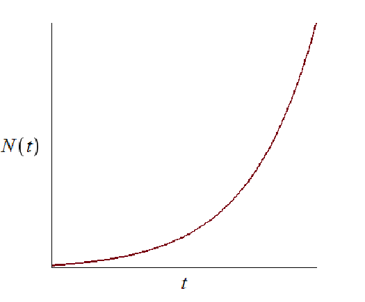
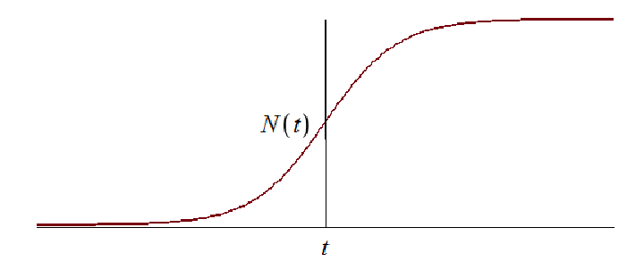
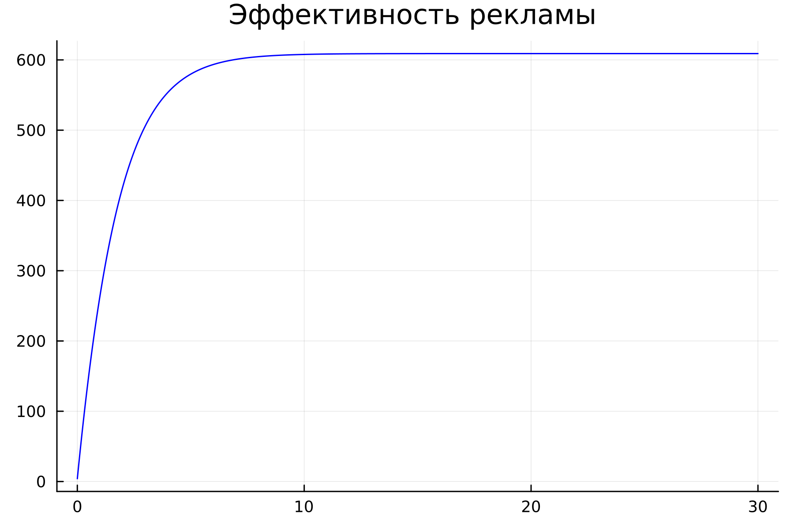
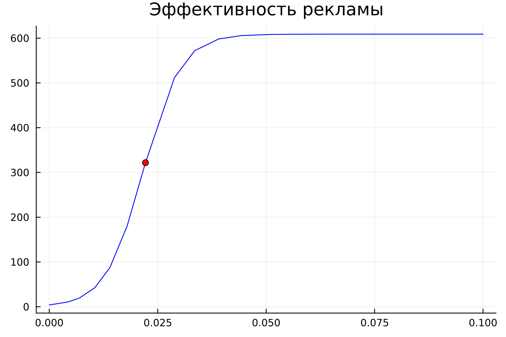
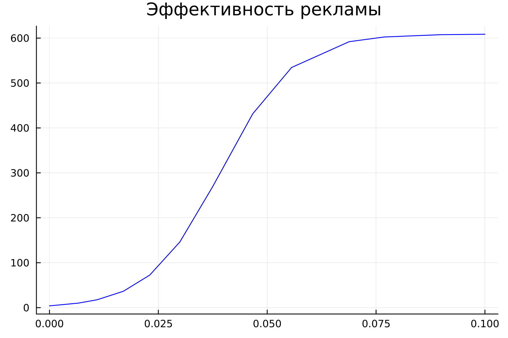
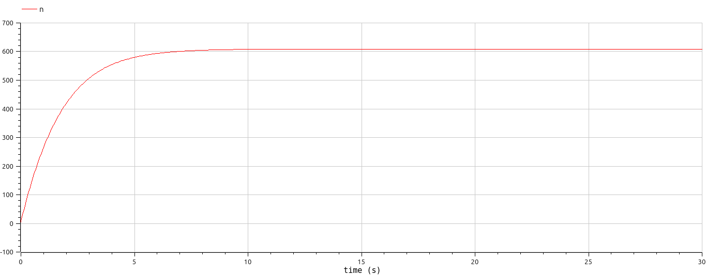
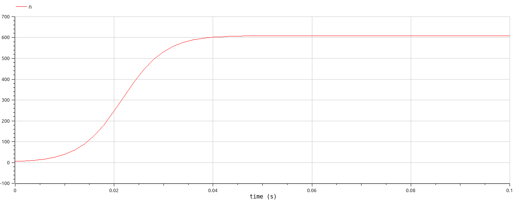
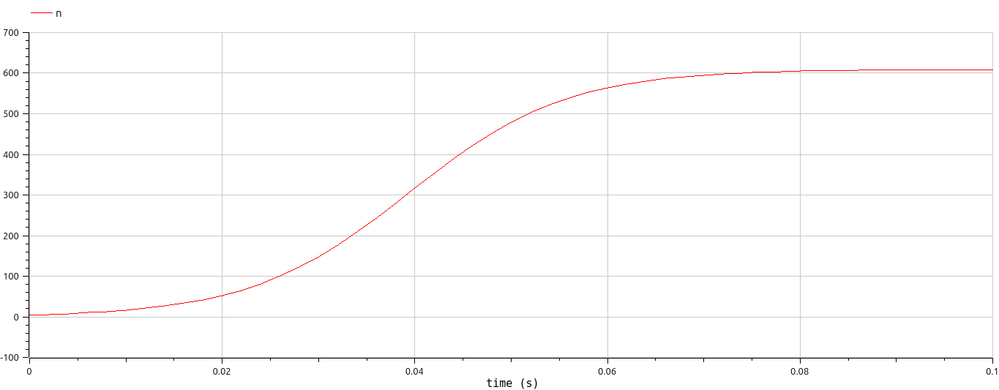

# Лабораторная работа №7

## "Модель распространения рекламы"

Выполнил: Кармацкий Никита Сергеевич

НФИбд-01-21

---

# Цель работы:

Изучить модель распростаранния рекламы. Применить ее на практике для решения задания лабораторной работы

---
# Теоретическая справка. Математическая модель.
Мальтузианская модель роста (англ. Malthusian growth model), также называемая моделью Мальтуса — это экспоненциальный рост с постоянным темпом. Модель названа в честь английского демографа и экономиста Томаса Мальтуса. [4]
___
Модель рекламной кампании описывается следующими величинами.
Считаем, что $\frac{dn}{dt}$ - скорость изменения со временем числа потребителей, узнавших о товаре и готовых его купить, $t$ - время, прошедшее с начала рекламной кампании, $N$ - общее число потенциальных платежеспособных покупателей, $n(t)$ - число  уже информированных клиентов.
Эта величина пропорциональна числу покупателей, еще не знающих о нем, это описывается следующим образом $\alpha _1(t)(N-n(t))$, где $\alpha _1>0$ -  характеризует интенсивность рекламной кампании (зависит от затрат на рекламу в данный момент времени).
Помимо этого, узнавшие о товаре потребители также распространяют полученную информацию среди потенциальных покупателей, не знающих о нем (в этом случае работает т.н. сарафанное радио). Этот вклад в рекламу описывается величиной  $\alpha _2(t)n(t)(N-n(t))$. эта величина увеличивается с увеличением потребителей узнавших о товаре.
___
Математическая модель распространения рекламы описывается уравнением:

$$\frac{dn}{dt} = (\alpha _1(t) + \alpha _2(t)n(t))(N-n(t))$$

---
При $\alpha _1(t) >> \alpha _2(t)$ получается модель типа модели Мальтуса, решение которой имеет вид 

Рис.1 График решения уравнения модели Мальтуса

---

В обратном случае $\alpha _1(t) << \alpha _2(t)$ получаем уравнение логистической кривой

Рис.2 График логистической кривой

---
# Задание лабораторной работы:
Вариант 32

Постройте график распространения рекламы, математическая модель которой описывается следующим уравнением:

1.	$\frac{dn}{dt} = (0.54 + 0.00016n(t))(N-n(t))$
2.	$\frac{dn}{dt} = (0.000021 + 0.38n(t))(N-n(t))$
3.	$\frac{dn}{dt} = (0.2\cos{t} + 0.2\cos{(2t)}  n(t))(N-n(t))$

При этом объем аудитории $N = 609$, в начальный момент о товаре знает 4 человек.

Для случая 2 определите в какой момент времени скорость распространения рекламы будет иметь максимальное значение.
___

# Основные этапы выполнения работы

---

## 1. Результат работы программы для первого случая. Julia

Рис.1 График первого случая на Julia

---

## 2. Результат работы программы для второго случая. Julia

Рис.2 График второго случая на Julia

---

## 3. Результат работы программы для третьего случая. Julia

Рис.3 График третьего случая на Julia

---

## 4. Результат работы программы для первого случая. OpenModelica

Рис.4 График первого случая на OpenModelica

---

## 5. Результат работы программы для второго случая. OpenModelica

Рис.5 График второго случая на OpenModelica

---
## 6. Результат работы программы для третьего случая. OpenModelica

Рис.6 График третьего случая на OpenModelica

---
## Анализ полученных результатов. Сравнение языков.

В итоге проделанной работы мы построили графики распространения рекламы для трех случаев на языках Julia и OpenModelica. Построение модели распространения рекламы на языке OpenModelica занимает значительно меньше строк, чем аналогичное построение на Julia. 
Кроме того, построения на языке OpenModelica проводятся относительно значения времени t по умолчанию, что упрощает нашу работу. 

---

# Вывод:

В ходе выполнения лабораторной работы была изучена модель эффективности рекламы и в дальнейшем построена модель на языках Julia и Open Modelica

---

# Список литературы. Библиография

- Документация по Julia: https://docs.julialang.org/en/v1/
- Документация по OpenModelica: https://openmodelica.org/
- Решение дифференциальных уравнений: https://www.wolframalpha.com/
- Мальтузианская модель роста: https://www.stolaf.edu//people/mckelvey/envision.dir/malthus.html

---

# Спасибо за внимание
