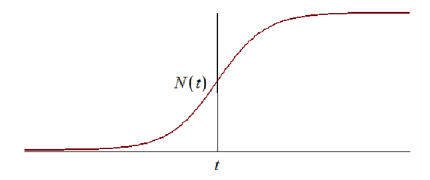
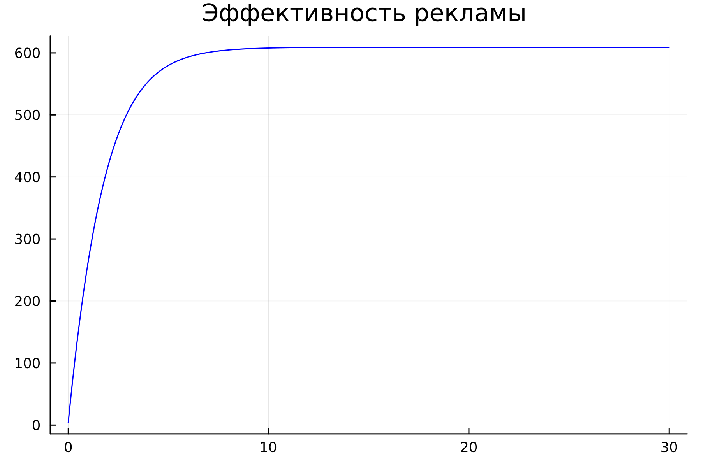
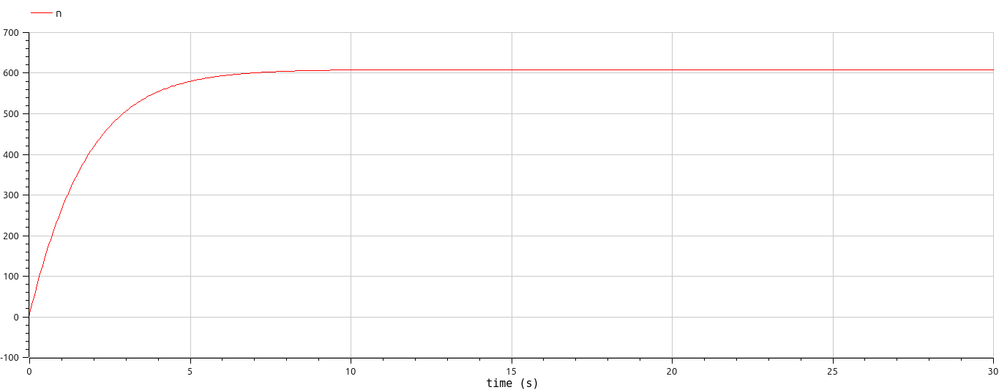
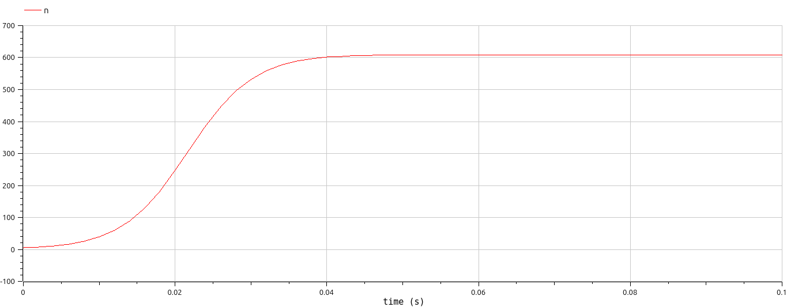
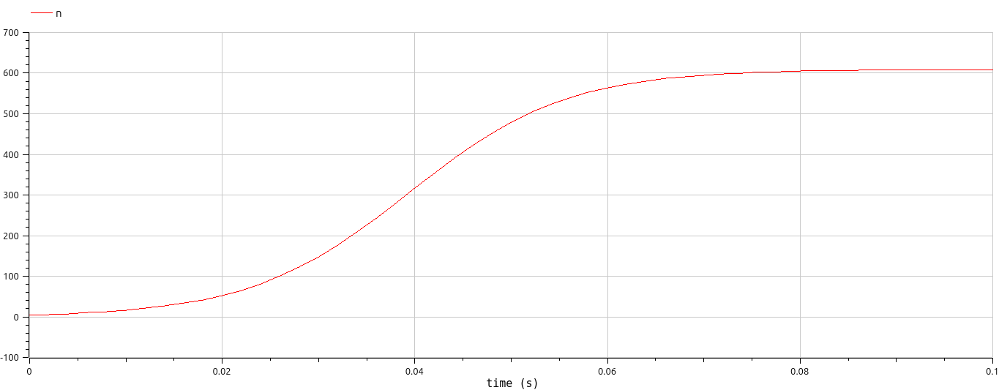

## РОССИЙСКИЙ УНИВЕРСИТЕТ ДРУЖБЫ НАРОДОВ им. Патриса Лулумбы

### Факультет физико-математических и естественных наук

### Кафедра теории вероятности и кибербезопасности

&nbsp;

&nbsp;

&nbsp;&nbsp;

##### ОТЧЕТ

##### ПО ЛАБОРАТОРНОЙ РАБОТЕ №7

*дисциплина: Математическое моделирование*

&nbsp;

Студент: Кармацкий Никита Сергеевич

Номер студ.билета: 1032210091

Группа: НФИбд-01-21

&nbsp;

##### Москва

2024 г.

&nbsp;
&nbsp;
&nbsp;
&nbsp;
&nbsp;
&nbsp;
&nbsp;
&nbsp;

&nbsp;
&nbsp;
&nbsp;

### Цель работы:

Изучить модель эффективности рекламы. Применить их на практике для решения задания лабораторной работы

### Теоретическое введение

Организуется рекламная кампания нового товара или услуги. Необходимо, чтобы прибыль будущих продаж с избытком покрывала издержки на рекламу. Вначале расходы могут превышать прибыль, поскольку лишь малая часть потенциальных покупателей будет информирована о новинке. Затем, при увеличении числа продаж, возрастает и прибыль, и, наконец, наступит момент, когда рынок насытиться, и рекламировать товар станет бесполезным.

Предположим, что торговыми учреждениями реализуется некоторая продукция, о которой в момент времени $t$ из числа потенциальных покупателей $N$ знает лишь $n$ покупателей. Для ускорения сбыта продукции запускается реклама по радио, телевидению и других средств массовой информации. После запуска рекламной кампании информация о продукции начнет распространяться среди потенциальных покупателей путем общения друг с другом. Таким образом, после запуска рекламных объявлений скорость изменения числа знающих о продукции людей пропорциональна как числу знающих о товаре покупателей, так и числу покупателей о нем не знающих

Модель рекламной кампании описывается следующими величинами.
Считаем, что $\frac{dn}{dt}$ - скорость изменения со временем числа потребителей, узнавших о товаре и готовых его купить,
$t$ - время, прошедшее с начала рекламной кампании,
$N$ - общее число потенциальных платежеспособных покупателей,
$n(t)$ - число  уже информированных клиентов.
Эта величина пропорциональна числу покупателей, еще не знающих о нем, это описывается следующим образом
$\alpha _1(t)(N-n(t))$, где $\alpha _1>0$ -  характеризует интенсивность рекламной кампании (зависит от затрат на рекламу в данный момент времени).
Помимо этого, узнавшие о товаре потребители также распространяют полученную информацию среди потенциальных покупателей, не знающих о нем (в этом случае работает т.н. сарафанное радио). Этот вклад в рекламу описывается величиной  $\alpha _2(t)n(t)(N-n(t))$. эта величина увеличивается с увеличением потребителей узнавших о товаре.

Математическая модель распространения рекламы описывается уравнением:

$$\frac{dn}{dt} = (\alpha _1(t) + \alpha _2(t)n(t))(N-n(t))$$

При $\alpha _1(t) >> \alpha _2(t)$ получается модель типа модели Мальтуса, решение которой имеет вид 


Рис.1 График решения уравнения модели Мальтуса

В обратном случае $\alpha _1(t) << \alpha _2(t)$ получаем уравнение логистической кривой



Рис.2 График логистической кривой


# Задание

Вариант 32

Постройте график распространения рекламы, математическая модель которой описывается следующим уравнением:

1.	$\frac{dn}{dt} = (0.54 + 0.00016n(t))(N-n(t))$
2.	$\frac{dn}{dt} = (0.000021 + 0.38n(t))(N-n(t))$
3.	$\frac{dn}{dt} = (0.2\cos{t} + 0.2\cos{(2t)}  n(t))(N-n(t))$

При этом объем аудитории $N = 609$, в начальный момент о товаре знает 4 человек.

Для случая 2 определите в какой момент времени скорость распространения рекламы будет иметь максимальное значение.


# Основные этапы выполнения работы

## Решение с помощью кода

### 1. Julia

Листинг программы для первого случая на Julia:

$\frac{dn}{dt} = (0.54 + 0.00016n(t))(N-n(t))$
:

```
using Plots
using DifferentialEquations

N = 609
n0 = 4

function ode_fn(du, u, p, t)
	(n) = u
	du[1] = (0.54 + 0.00016*u[1])*(N-u[1])
end

v0 = [n0]
tspan = (0.0, 30.0)
prob = ODEProblem(ode_fn, v0, tspan)
sol = solve(prob, dtmax = 0.05)
n = [u[1] for u in sol.u]
T = [t for t in sol.t]

plt = plot(
           dpi = 300,
           title = "Эффективность рекламы ",
           legend = false)
plot!(
      plt,
      T,
      n,
      color = :blue)

savefig(plt, "lab07_1.png")
```



Рис.3 График первого случая на Julia

&nbsp;

Листинг программы для второго случая на Julia:

$\frac{dn}{dt} = (0.000021 + 0.38n(t))(N-n(t))$:

```
using Plots
using DifferentialEquations

N = 609
n0 = 4

function ode_fn(du, u, p, t)
	(n) = u
	du[1] = (0.000021 + 0.38*u[1])*(N-u[1])
end

v0 = [n0]
tspan = (0.0, 0.1)
prob = ODEProblem(ode_fn, v0, tspan)
sol = solve(prob)
n = [u[1] for u in sol.u]
T = [t for t in sol.t]

max_dn = 0;
max_dn_t = 0;
max_dn_n = 0;
for (i, t) in enumerate(T)
  if sol(t, Val{1})[1] > max_dn
    global max_dn = sol(t, Val{1})[1]
    global max_dn_t = t
    global max_dn_n = n[i]
  end
end

plt = plot(
           dpi = 300,
           title = "Эффективность рекламы",
           legend = false)
plot!(
      plt,
      T,
      n,
      color = :blue)
plot!(
      plt,
      [max_dn_t],
      [max_dn_n],
      seriestype = :scatter,
      color = :red)

savefig(plt, "lab07_2.png")

```


Рис.4 График второго случая на Julia

&nbsp;

Листинг программы для третьего случая на Julia:

$\frac{dn}{dt} = (0.2\cos{t} + 0.2\cos{(2t)}  n(t))(N-n(t))$
:

```
using Plots
using DifferentialEquations

N = 609
n0 = 4

function ode_fn(du, u, p, t)
	(n) = u
	du[1] = (0.54 + 0.00016*u[1])*(N-u[1])
end

v0 = [n0]
tspan = (0.0, 30.0)
prob = ODEProblem(ode_fn, v0, tspan)
sol = solve(prob, dtmax = 0.05)
n = [u[1] for u in sol.u]
T = [t for t in sol.t]

plt = plot(
           dpi = 300,
           title = "Эффективность рекламы ",
           legend = false)
plot!(
      plt,
      T,
      n,
      color = :blue)

savefig(plt, "lab07_1.png")
```


Рис.5 График третьего случая на Julia

&nbsp;

### 2. OpenModelica

Листинг первой программы на Open Modelica для первого случая:

$\frac{dn}{dt} = (0.000021 + 0.38n(t))(N-n(t))$

```
model Lab7_1
Real N = 609;
Real n;
initial equation
n = 4;
equation
der(n) = (0.54 + 0.00016*n)*(N-n);
annotation(experiment(StartTime = 0, StopTime = 30, Interval = 0.05));
end Lab7_1;
```



Рис.6 График первого случая на OpenModelica

&nbsp;

Листинг второй программы на Open Modelica для второго случая:

$\frac{dn}{dt} = (0.000021 + 0.38n(t))(N-n(t))$:


```
model Lab7_2
Real N = 609;
Real n;
initial equation
n = 4;
equation
der(n) = (0.000021 + 0.38*n)*(N-n);
annotation(experiment(StartTime = 0, StopTime = 0.1, Interval = 0.002));
end Lab7_2;
```



Рис.7 График второго случая на OpenModelica

&nbsp;

Листинг третьей программы на Open Modelica для третьего случая:

$\frac{dn}{dt} = (0.2\cos{t} + 0.2\cos{(2t)}  n(t))(N-n(t))$

```
model Lab7_3
Real N = 609;
Real n;
initial equation
n = 4;
equation
der(n) = (0.2*cos(time) + 0.2*cos(2*time)*n)*(N-n);
annotation(experiment(StartTime = 0, StopTime = 0.1, Interval = 0.002));
end Lab7_3;
```



Рис.8 График третьего случая на OpenModelica

&nbsp;

# Анализ полученных результатов. Сравнение языков.

В итоге проделанной работы мы построили графики распространения рекламы для трех случаев на языках Julia и OpenModelica. Построение модели распространения рекламы на языке OpenModelica занимает значительно меньше строк, чем аналогичное построение на Julia. 
Кроме того, построения на языке OpenModelica проводятся относительно значения времени t по умолчанию, что упрощает нашу работу. 

## Вывод:

В ходе выполнения лабораторной работы была изучена модель эффективности рекламы и в дальнейшем построена модель на языках Julia и Open Modelica

# Список литературы. Библиография

- Документация по Julia: https://docs.julialang.org/en/v1/
- Документация по OpenModelica: https://openmodelica.org/
- Решение дифференциальных уравнений: https://www.wolframalpha.com/
- Мальтузианская модель роста: https://www.stolaf.edu//people/mckelvey/envision.dir/malthus.html