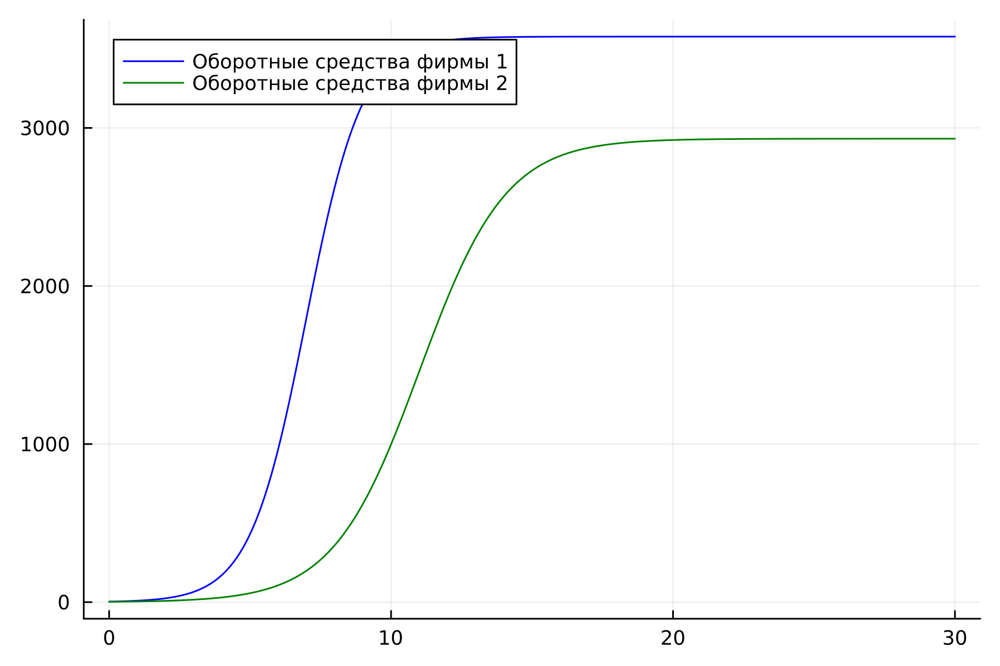
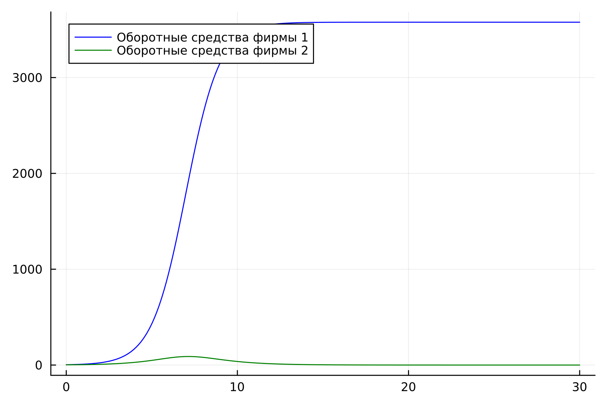
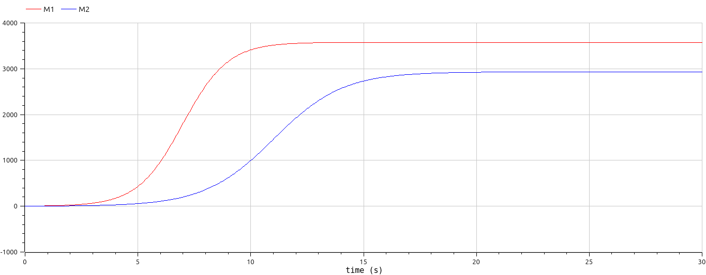
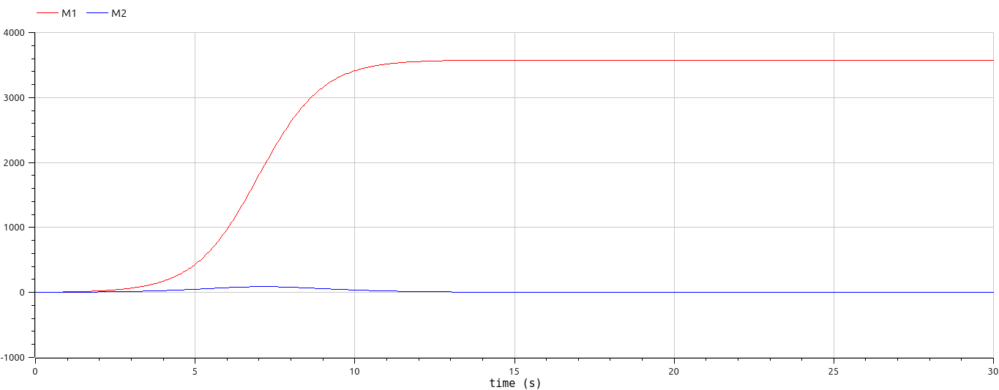

# Лабораторная работа №8

## "Модель конкуренции двух фирм"

Выполнил: Кармацкий Никита Сергеевич

НФИбд-01-21

---

# Цель работы:

Изучить модель конкуренции двух фирм. Применить её на практике для решения задания лабораторной работы

---
# Теоретическая справка:
Для построения модели конкуренции хотя бы двух фирм необходимо рассмотреть модель одной фирмы. Вначале рассмотрим модель фирмы, производящей продукт долговременного пользования, когда цена его определяется балансом спроса и предложения. Примем, что этот продукт занимает определенную нишу рынка и конкуренты в ней отсутствуют. 
___
Обозначим:

$N$ - число потребителей производимого продукта. 

$S$ – доходы потребителей данного продукта. Считаем, что доходы всех потребителей одинаковы. Это предположение справедливо, если речь идет об одной рыночной нише, т.е. производимый продукт ориентирован на определенный слой населения. 

$M$ – оборотные средства предприятия 

$\tau$ - длительность производственного цикла

$p$ - рыночная цена товара 

$\widetilde{p}$ - себестоимость продукта, то есть переменные издержки на производство единицы продукции

---

$\delta$ - доля оборотных средств, идущая на покрытие переменных издержек

$k$ - постоянные издержки, которые не зависят от количества выпускаемой продукции

$Q(S/p)$ – функция спроса, зависящая от отношения дохода $S$ к цене $p$. Она равна количеству продукта, потребляемого одним потребителем в единицу времени.

---

Функцию спроса товаров долговременного использования часто представляют в простейшей форме: 

$$Q = q - k\frac{p}{S} = q(1 - \frac{p}{p_{cr}})$$

где $q$ – максимальная потребность одного человека в продукте в единицу времени.
Эта функция падает с ростом цены и при $p = p_{cr}$ (критическая стоимость продукта) потребители отказываются от приобретения товара. Величина $p_{cr} = Sq/k$. Параметр $k$ – мера эластичности функции спроса по цене. Таким образом, функция спроса является пороговой (то есть, $Q(S/p) = 0$ при $p \geq p_{cr}$) и обладает свойствами насыщения.

---

Уравнения динамики оборотных средств (1 вид):

$$\frac{dM}{dt} = -\frac{M \delta}{\tau} + NQp - k = -\frac{M\delta}{\tau} + Nq(1 - \frac{p}{p_{cr}})p - k$$

---

Уравнения динамики оборотных средств (2 вид):

$$\frac{dM}{dt} = -\frac{M \delta}{\tau}(\frac{p}{p_{cr}}-1) - M^2 ( \frac{\delta}{\tau \widetilde{p} })^2 \frac{p_{cr}}{Nq} - k$$

---

В обсуждаемой модели параметр $\delta$ всюду входит в сочетании с $\tau$. Это значит, что уменьшение доли оборотных средств, вкладываемых в производство, эквивалентно удлинению производственного цикла. Поэтому мы в дальнейшем положим: $\delta = 1$, а параметр $\tau$ будем считать временем цикла, с учётом сказанного.

---
# Задание лабораторной работы:
>Случай 1

Рассмотрим две фирмы, производящие взаимозаменяемые товары одинакового качества и находящиеся в одной рыночной нише. Считаем, что в рамках нашей модели конкурентная борьба ведётся только рыночными методами. То есть, конкуренты могут влиять на противника путем изменения параметров своего производства: себестоимость, время цикла, но не могут прямо вмешиваться в ситуацию на рынке («назначать» цену или влиять на потребителей каким-либо иным способом.) Будем считать, что постоянные издержки пренебрежимо малы, и в модели учитывать не будем. В этом случае динамика изменения объемов продаж фирмы 1 и фирмы 2 описывается следующей системой уравнений:

---

$$\frac{dM_1}{d\Theta} = M_1 - \frac{b}{c_1}M_1 M_2 - \frac{a1}{c1} M_1^2 $$

$$ \frac{dM_2}{d\Theta} = \frac{c_2}{c_1} M_2 - \frac{b}{c_1} M_1 M_2 - \frac{a_2}{c_1} M_2^2$$

---

где 

$$ a_1 = \frac{p_{cr}}{\tau_1^2 \widetilde{p}_1^2 Nq } $$
$$ a_2 = \frac{p_{cr}}{\tau_2^2 \widetilde{p}_2^2 Nq } $$ 
$$ b = \frac{p_{cr}}{\tau_1^2 \widetilde{p}_1^2 \tau_2^2 \widetilde{p}_2^2 Nq} $$
$$ c_1 = \frac{p_{cr} - \widetilde{p}_1}{\tau_1 \widetilde{p}_1} $$
$$ c_2 = \frac{p_{cr} - \widetilde{p}_2}{\tau_2 \widetilde{p}_2} $$

также введена нормировка $t = c_1 \Theta$

---
>Случай 2

Рассмотрим модель, когда, помимо экономического фактора влияния (изменение себестоимости, производственного цикла, использование кредита и т.п.), используются еще и социально-психологические факторы – формирование общественного предпочтения одного товара другому, не зависимо от их качества и цены. В этом случае взаимодействие двух фирм будет зависеть друг от друга, соответственно коэффициент перед $M_1 M_2$ будет отличаться. Пусть в рамках рассматриваемой модели динамика изменения объемов продаж фирмы 1 и фирмы 2 описывается следующей системой уравнений:

---

$$\frac{dM_1}{d\Theta} = M_1 - \frac{b}{c_1}M_1 M_2 - \frac{a1}{c1} M_1^2 $$

$$ \frac{dM_2}{d\Theta} = \frac{c_2}{c_1} M_2 - (\frac{b}{c_1}+0.00033) M_1 M_2 - \frac{a_2}{c_1} M_2^2$$

---

Для обоих случаев рассмотрим задачу со следующими начальными условиями и параметрами

$$ M_0^1=3.3 \: M_0^2=2.2 $$
$$ p_{cr}=26 \: N=33 \: q=1 $$
$$ \tau_1=25 \: \tau_2=14 $$
$$ \widetilde{p}_1=5.5 \: \widetilde{p}_2=11 $$
___
# Задачи:

1.	Изучить модель конкуренции двух фирм

2.	Построить графики изменения оборотных средств двух фирм для обоих случаев

---

# Основные этапы выполнения работы

---
## 1. Результат работы программы для первого случая. Julia

Рис.1 График первого случая на Julia

---

## 2. Результат работы программы для второго случая. Julia

Рис.2 График второго случая на Julia

---

## 3. Результат работы программы для первого случая. OpenModelica

Рис.3 График первого случая на OpenModelica

---

## 4. Результат работы программы для второго случая. OpenModelica

Рис.4 График второго случая на OpenModelica

---

## Анализ полученных результатов. Сравнение языков.

В итоге проделанной работы на языках Julia  и Open Modelica мы построили графики изменения обортных средств для двух фирм со случаями, когда конкурентная борьба ведется только рыночными методами и когда, помимо экэномического фактора влияния, используется еще и социально-психологичнские факторы.

Построение модели на языке OpenModelica занимает значительно меньше строк и времени, чем аналогичное построение на языке Julia.

---

## Вывод:

В ходе выполнения лабораторной работы была изучена модель конкуренции двух фирм и в дальнейшем построена модель на языках Julia и Open Modelica.

---

# Список литературы. Библиография

- Документация по Julia: https://docs.julialang.org/en/v1/
- Документация по OpenModelica: https://openmodelica.org/
- Решение дифференциальных уравнений: https://www.wolframalpha.com/
- Мальтузианская модель роста: https://www.stolaf.edu//people/mckelvey/envision.dir/malthus.html
- Математические модели конкурентной среды: https://dspace.spbu.ru/bitstream/11701/12019/1/Gorynya_2018.pdf
- Разработка математических моделей конкурентных процессов: https://www.academia.edu/9284004 Наумейко_РАЗРАБОТКА_МАТЕМАТИЧЕСКОЙ_МОДЕЛИ_КОНКУРЕНТНЫХ_ПРОЦЕССОВ 

---

# Спасибо за внимание
